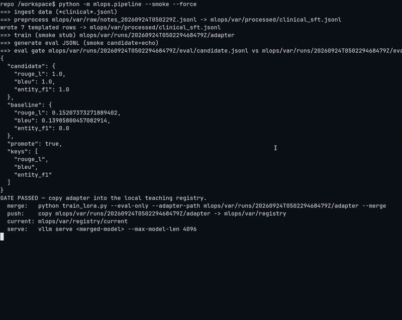

# Blog: Fine-tuning Qwen with LoRA (clinical notes, then a coding agent)

This is the short companion to the full tutorial in [README.md](README.md).
Read that file if you want every command, table, and diagram. This page is the
story and the recommendations.

## The one rule that matters

Use the **same tokenizer** and the **same chat template** when you train, when
you evaluate, and when you serve. If those drift, the model you just fine-tuned
looks worse than the base model — not because LoRA failed, but because the
text no longer looks like the text it trained on.

## Use case 1 — clinical notes

You have (synthetic, in this repo) instruction-response pairs: “summarize this
progress note”, “extract meds and allergies”, “write a discharge paragraph”.
You load `Qwen/Qwen2.5-7B-Instruct`, freeze it, attach a small LoRA adapter
with PEFT, and train with TRL’s `SFTTrainer`.

**Recommendation:** LoRA (or QLoRA on a 16–24 GB GPU) on Qwen2.5-7B-Instruct.
You get most of the domain-adaptation quality of full fine-tuning, you only
checkpoint a few tens of megabytes, and you stay on an Apache-2.0 model with a
mature Hugging Face stack. Do not start from an imaging model such as
NV-Reason-CXR; that family is built for radiographs, not note text.

The bundled notes are fake. Real PHI never belongs in git, in a public
dataset card, or in an unencrypted laptop folder. A clinical language model
is research software, not a medical device.

Walkthrough: [README — clinical pipeline](README.md#use-case-1-fine-tuning-qwen-on-clinical-notes).

## Use case 2 — a code model for your own agent harness

A company using Cursor plus a third-party model wants its *own* model inside a
*custom* harness: send repo context, get a completion, run tests, feed errors
back. Code is less forgiving than notes. A missing comma is a failed unit test.

**Recommendation:** start from `Qwen2.5-Coder-7B-Instruct`, still with LoRA,
and train three data shapes — FIM, instruction, and repo-level review comments.
Build a single-turn harness first. Multi-turn “agentic” loops come after the
model can pass your internal unit tests.

Walkthrough: [README — coding agent](README.md#use-case-2-fine-tuning-a-code-model-for-your-own-agent-harness).

## Use case 3 — MLOps around the model

Fine-tuning once is a tutorial. Shipping it is a loop: ingest → de-identify
and template → train → **evaluation gate** → deploy only if you beat
production → watch for drift → roll back.

**Recommendation:** a small team can do this with Prefect or cron, DVC, MLflow,
one GPU box, and vLLM. A larger org adds Airflow, Kubernetes, a real registry,
and a human review step before anything clinical goes near a patient-facing
system.

Walkthrough: [README — MLOps pipeline](README.md#mlops-pipeline-automating-the-full-lifecycle).

### Watch the pipeline run

[Full MP4 recording](docs/media/pipeline-e2e-smoke.mp4) — six stages: ingest → preprocess → smoke train → generate eval → eval gate → local registry deploy on promote. The keep-current (gate fail) path is in [pipeline-e2e-gate-fail.mp4](docs/media/pipeline-e2e-gate-fail.mp4).

## License

Tutorial code is MIT (see [LICENSE](LICENSE)). Model weights keep their
upstream licenses. Nothing here is a medical device or a substitute for a
clinician.
