# Fine-tuning Qwen with LoRA on clinical notes

A beginner-friendly tutorial for taking an instruction-tuned Qwen model, attaching a small LoRA adapter, and teaching it to write from **synthetic** clinical notes. The same recipe later extends to a **coding-agent** model and to an **MLOps** loop that can train, gate, and deploy without a human babysitting every job.

The long version lives in this README (it *is* the blog post). A shorter narrative is in [BLOG.md](BLOG.md). Runnable code is in [`train_lora.py`](train_lora.py).

> **Privacy / HIPAA warning.** The notes in this repository are 100% fake. They use invented names, invented MRNs (`DEMO-0001`), and invented stories. **Never** fine-tune on real patient notes, screenshots, EHR exports, or anything that could be PHI unless you have a documented legal basis, a BAA where required, de-identification, access control, and a security review. Do not commit real notes to git. Do not paste them into a public notebook. If you are not sure whether a field is PHI, treat it as PHI.

> **Not a medical device.** A fine-tuned clinical language model is research software. It can invent facts (“hallucinate”), miss a negation, and look confident while being wrong. It must not diagnose, treat, or write the record of a real patient without a qualified human in the loop and a regulatory path you do not have just because you trained LoRA.

> **License.** Tutorial code in this repo is [MIT](LICENSE). Model weights keep their own licenses (Qwen2.5 is Apache 2.0). You still have to follow both.

---

## Table of contents

1. [What you will learn](#what-you-will-learn)
2. [The golden rule](#the-golden-rule-same-tokenizer-same-chat-template)
3. [Choosing a method](#choosing-a-method-lora-vs-the-alternatives)
4. [Choosing a base model](#choosing-a-base-model-for-clinical-text)
5. [Pictures of the pipeline](#pictures-of-the-pipeline)
6. [Setup](#setup)
7. [Use case 1 — clinical notes](#use-case-1-fine-tuning-qwen-on-clinical-notes)
    - [Step 1. Load the model and tokenizer](#step-1-load-the-base-model-and-tokenizer)
    - [Step 2. Prepare instruction-response pairs](#step-2-prepare-instruction-response-pairs-from-clinical-notes)
    - [Step 3. Apply the Qwen chat template](#step-3-apply-the-qwen-chat-template)
    - [Step 4. Tokenize](#step-4-tokenization)
    - [Step 5. Configure LoRA](#step-5-lora-configuration)
    - [Step 6. Attach the adapter](#step-6-attach-the-adapter-with-peft)
    - [Step 7. Train with SFTTrainer](#step-7-train-with-sfttrainer)
    - [Step 8. Save adapter weights](#step-8-save-adapter-weights)
    - [Step 9. Merge (optional)](#step-9-merge-the-adapter-into-the-base-model)
    - [Step 10. Evaluate on held-out data](#step-10-evaluate-on-held-out-data)
8. [GPU and memory tips](#gpu-and-memory-tips)
9. [Run the training script](#run-the-training-script)
10. [Troubleshooting](#troubleshooting)
11. [Use case 2 — a code model for your own agent harness](#use-case-2-fine-tuning-a-code-model-for-your-own-agent-harness)
12. [MLOps pipeline: automating the full lifecycle](#mlops-pipeline-automating-the-full-lifecycle)
13. [License and research-only reminder](#license-and-research-only-reminder)

---

## What you will learn

By the end of use case 1 you can:

- Load `Qwen/Qwen2.5-7B-Instruct` (or a smaller Qwen2 Instruct cousin) from Hugging Face.
- Turn fake clinical notes into instruction-response chats.
- Wrap every example with the **Qwen chat template**.
- Tokenize with the **same** tokenizer the model shipped with.
- Attach LoRA with PEFT (`get_peft_model`).
- Supervised-fine-tune with TRL’s `SFTTrainer`.
- Save a small adapter, optionally merge it, and eval on notes the trainer never saw.

Jargon, once:

- **Base model** — the published weights you start from. We freeze them.
- **Tokenizer** — the program that chops text into integer **tokens** the model knows.
- **Chat template** — the extra markup (`<|im_start|>user` …) that tells Qwen who is speaking.
- **Fine-tuning** — continuing training so the model leans toward *your* tasks.
- **LoRA** (Low-Rank Adaptation) — instead of updating every weight, you train two tiny matrices `A` and `B` and add `scale * B @ A` to a frozen layer.
- **Adapter** — those extra matrices, plus a config file. Often tens of megabytes, not tens of gigabytes.
- **SFT** (supervised fine-tuning) — show complete answers and train the model to write them.
- **PEFT** — Hugging Face’s library for LoRA and friends.
- **TRL** — Hugging Face’s trainer helpers, including `SFTTrainer`.

### Key takeaways

- This tutorial is a full pipeline, not a single magic command.
- The data here is synthetic on purpose.
- LoRA means “train a small add-on,” not “retrain Qwen from scratch.”

---

## The golden rule: same tokenizer, same chat template

Write this on a sticky note:

**Train, evaluate, and serve with the same `model_id`, the same tokenizer, and the same `apply_chat_template` settings.**

What goes wrong if they drift:

| What you changed | What the model sees | Typical symptom |
| --- | --- | --- |
| A different tokenizer (or a “fast” vs “slow” mismatch you did not mean) | Different integer IDs for the same word | Garbage, or fluent English that ignores the instruction |
| Fine-tuned with the Qwen template, served as raw `### Instruction:` text | The prompt no longer looks like training | Model rambles or repeats the note |
| `add_generation_prompt=True` while the assistant answer is already in the example | A second `assistant` header in the middle of the target | Loss looks weird; answers start with role tags |
| Saved only the adapter, then loaded it on a *different* base checkpoint | LoRA math is applied to the wrong `W` | Quality collapse, sometimes NaNs |

`train_lora.py` always does this:

```python
text = tokenizer.apply_chat_template(
    messages,
    tokenize=False,
    add_generation_prompt=False,  # training: the answer is already in `messages`
)
```

and at inference:

```python
prompt = tokenizer.apply_chat_template(
    prompt_messages,              # system + user only
    tokenize=False,
    add_generation_prompt=True,   # inference: ask the model to start the assistant turn
)
```

Those two flags are the whole difference between “here is a finished chat” and “please write the next turn.”

### Key takeaways

- The chat template is part of the model, not decoration.
- Inference drops the gold assistant turn and sets `add_generation_prompt=True`.
- Changing the base checkpoint under an adapter is a silent failure.

---

## Choosing a method: LoRA vs the alternatives

| Method | Memory usage | Training speed | Quality (for this task) | Trainable parameters | When to use |
| --- | --- | --- | --- | --- | --- |
| **Full fine-tuning** | Highest — you need room for all weights, gradients, and optimizer state | Slowest | Highest ceiling if you have a lot of clean data and budget | 100% of the model (billions) | Research labs with multi-GPU pods and a true domain corpus |
| **LoRA** | Low — base weights frozen, often in bf16 | Fast | Very strong for style / format / specialty wording | ~0.1–1% (rank `r` × targeted layers) | **Default for clinical-note SFT on a single GPU** |
| **QLoRA** | Lowest — base loaded in 4-bit, LoRA in bf16 | A bit slower than 16-bit LoRA (dequant on the fly) | Nearly LoRA, sometimes a hair worse | Same small adapter | 16–24 GB cards, or 7B/14B when bf16 does not fit |
| **Prefix tuning** | Low | Fast | Weaker for long, structured generation | A learned “virtual prefix” per layer | When you must not touch attention weights at all |
| **Prompt tuning** | Lowest | Fastest | Weakest here — a short soft prompt rarely teaches SOAP structure | A few thousand embeddings | Classification or very short completions, not note writing |

> **Recommendation.** For clinical note *generation* (summaries, SOAP rewrites, med lists) use **LoRA**. It is the best quality-per-GPU-hour tradeoff, the adapter is cheap to store and swap, and the Hugging Face path (`peft` + `trl`) is the one this tutorial can actually run. If the 7B model does not fit, use **QLoRA** (`--load-in-4bit`) with the same rank and the same chat template — do not jump to prefix/prompt tuning to save memory; those methods underfit long clinical prose. Full fine-tuning is rarely worth it until you have far more than a teaching JSONL.

### Key takeaways

- LoRA trains `A` and `B`, not the original `W`.
- QLoRA is LoRA plus a 4-bit base, not a different algorithm.
- Prompt-style methods are the wrong tool for multi-paragraph notes.

---

## Choosing a base model for clinical text

| Model | Parameter size | Medical pre-training | LoRA ecosystem maturity | License | Recommendation |
| --- | --- | --- | --- | --- | --- |
| **Qwen2.5 Instruct** | 7B (start here), 14B if you have VRAM | General web/code/math; not a dedicated clinical corpus | Excellent — first-class `transformers` + PEFT | Apache 2.0 | **Best default for this repo** |
| **Qwen2 Instruct** | 7B / 1.5B / … | Same family, slightly older | Excellent | Apache 2.0 | Fine if you already standardized on Qwen2 |
| **Llama 3 8B Instruct** | 8B | General; community medical spins exist *outside* Meta’s base | Excellent | Llama 3 Community (not Apache) | Strong runner-up if your org already accepted the Llama license |
| **Mistral 7B Instruct** | 7B | General | Excellent | Apache 2.0 | Good alternative; slightly less “chat-template documentation” than Qwen |
| **NVIDIA healthcare / Clara / NV-Reason-CXR** | Varies (CXR models are often ~3B) | **Imaging-heavy.** NV-Reason-CXR is trained to reason over chest X-rays, not to write EHR notes | Good inside NVIDIA NIM; less copy-paste with this PEFT script | NVIDIA / product-specific | Use for radiology *images*. **Do not pick it as the base for this text tutorial.** |

> **Recommendation.** Use **`Qwen/Qwen2.5-7B-Instruct`** for clinical note generation with LoRA. It is Apache 2.0, the chat template is stable, PEFT target-module names are well known (`q_proj`, `k_proj`, …), and 7B is the sweet spot between quality and a single-GPU budget. Move to 14B only after the 7B pipeline (template, data, eval) is boringly reliable. Skip NV-Reason-CXR and other Clara imaging checkpoints — they are honest specialists for pixels, not a better note-writer.

### Key takeaways

- “Healthcare” in the model card does not mean “good at progress notes.”
- License and chat-template stability matter as much as leaderboard scores.
- 7B Instruct + LoRA is the intended path through this tutorial.

---

## Pictures of the pipeline

### LoRA architecture (base frozen, A and B injected)

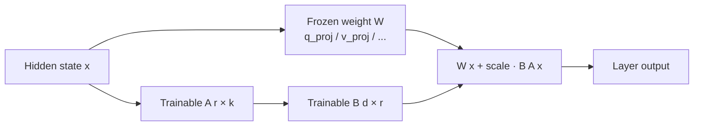

ASCII version of the same idea:

```
          x
          │
          ├──────────────────────────────┐
          │                              │
          ▼                              ▼
   ┌──────────────┐              ┌────────────┐
   │ Frozen W     │              │ LoRA A (r) │
   │ (billions)   │              └─────┬──────┘
   └──────┬───────┘                    │
          │                            ▼
          │                      ┌────────────┐
          │                      │ LoRA B     │
          │                      └─────┬──────┘
          │                            │
          └────────► +  (α / r)·BA  ◄──┘
                     │
                     ▼
                    y
```

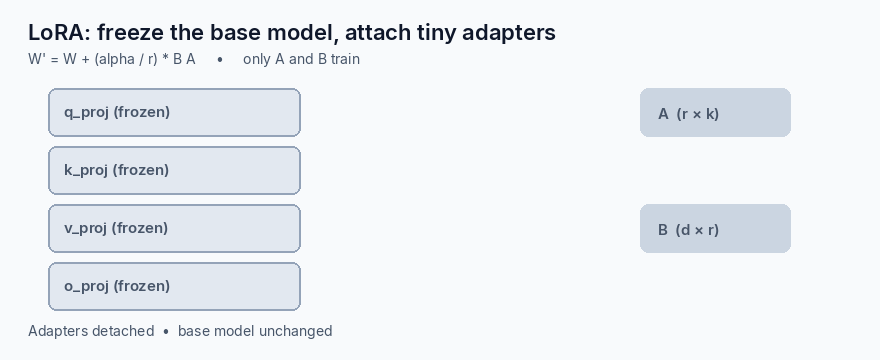

### Data-flow pipeline

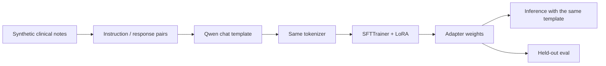

### Chat template structure

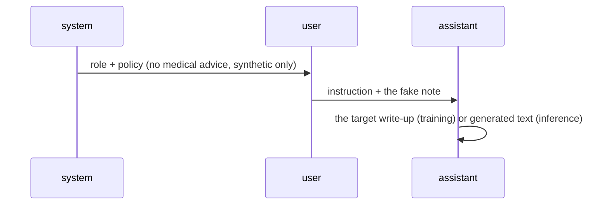

On disk that is just special tokens:

```
<|im_start|>system
You are a careful clinical documentation assistant. ...
<|im_end|>
<|im_start|>user
Summarize the following synthetic progress note ...
<|im_end|>
<|im_start|>assistant
- Interval history: ...
<|im_end|>
```

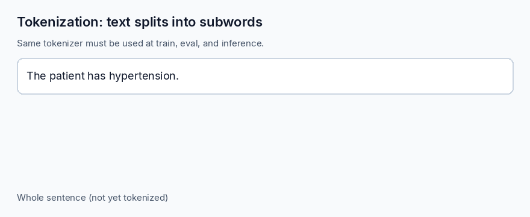

### Key takeaways

- Only `A` and `B` should receive gradients.
- Template → tokenize → train → infer is one path, not four inventions.
- System / user / assistant is how Qwen Instruct expects to be spoken to.

---

## Setup

You need Python 3.10+, `git`, and (for real training) an NVIDIA GPU with recent CUDA. Previewing data works on CPU.

```bash
python -m venv .venv
source .venv/bin/activate          # Windows: .venv\Scripts\activate
pip install -U pip
# Install the torch build that matches your CUDA from https://pytorch.org first.
pip install -r requirements.txt
```

Preview the synthetic chats **without** downloading 7B weights:

```bash
python train_lora.py --preview
```

No paid APIs are required. Everything talks to Hugging Face locally. If the model is gated in the future you would run `huggingface-cli login`; this tutorial does not invent tokens for you.

### Key takeaways

- `--preview` is the CPU-safe way to inspect templates.
- Pin `transformers` / `peft` / `trl` so the trainer API stays the one in this README.
- Do not put Hugging Face tokens in the repo.

---

# Use case 1: Fine-tuning Qwen on clinical notes

## Step 1. Load the base model and tokenizer

Always load **matching** pieces from the same `model_id`.

```python
import torch
from transformers import AutoModelForCausalLM, AutoTokenizer

model_id = "Qwen/Qwen2.5-7B-Instruct"

tokenizer = AutoTokenizer.from_pretrained(model_id, trust_remote_code=True)
if tokenizer.pad_token is None:
    tokenizer.pad_token = tokenizer.eos_token
tokenizer.padding_side = "right"

model = AutoModelForCausalLM.from_pretrained(
    model_id,
    trust_remote_code=True,
    torch_dtype=torch.bfloat16,
    device_map="auto",
)
model.config.use_cache = False  # needed when we use gradient checkpointing / SFT
```

Optional 4-bit path (QLoRA) if bf16 7B does not fit — same tokenizer, same template:

```python
from transformers import BitsAndBytesConfig

quant = BitsAndBytesConfig(
    load_in_4bit=True,
    bnb_4bit_compute_dtype=torch.bfloat16,
    bnb_4bit_quant_type="nf4",
    bnb_4bit_use_double_quant=True,
)
model = AutoModelForCausalLM.from_pretrained(
    model_id,
    quantization_config=quant,
    device_map="auto",
    trust_remote_code=True,
)
```

`train_lora.py` wraps both of these behind `--load-in-4bit` / `--load-in-8bit`.

### Key takeaways

- Tokenizer and model share one `model_id`.
- `pad_token` must exist; Qwen often reuses `eos_token`.
- 4-bit changes memory, not the chat template.

---

## Step 2. Prepare instruction-response pairs from clinical notes

We do **not** dump a raw chart into the trainer. We build a chat: a system policy, a user instruction plus the note, and an assistant answer we are willing to learn.

The file [`data/example_clinical_sft.jsonl`](data/example_clinical_sft.jsonl) holds a handful of invented cases (Alex Rivera, Jordan Lee, Sam Patel, …). Each line looks like this:

```json
{
  "id": "synth-001",
  "synthetic": true,
  "split": "train",
  "messages": [
    {"role": "system", "content": "You are a careful clinical documentation assistant. ..."},
    {"role": "user", "content": "Summarize the following synthetic progress note ..."},
    {"role": "assistant", "content": "- Interval history: ..."}
  ]
}
```

Load it:

```python
import json
from pathlib import Path

def load_jsonl(path: Path):
    rows = []
    with path.open(encoding="utf-8") as f:
        for line in f:
            if line.strip():
                rows.append(json.loads(line))
    return rows

rows = load_jsonl(Path("data/example_clinical_sft.jsonl"))
train = [r for r in rows if r.get("split") != "eval"]
held_out = [r for r in rows if r.get("split") == "eval"]
```

Design rules that keep you honest:

1. Every row sets `"synthetic": true`. The scripts treat a missing flag as a smell.
2. The assistant must **not** invent labs, meds, or diagnoses that the user note did not contain. Teaching the model to fabricate is how you get dangerous models.
3. Keep a held-out `split: eval`. If you judge the model on the same seven lines you trained on, you are grading the answer key.

If you later use a real de-identified corpus, keep that corpus off git and behind the same `messages` schema so nothing else in the pipeline changes.

### Key takeaways

- Instruction + note + answer, not a raw dump of the EHR.
- Refuse to learn facts that were not in the source note.
- Hold out data *before* you fall in love with the loss curve.

---

## Step 3. Apply the Qwen chat template

Do not hand-roll the markup on the training path. The tokenizer already knows it.

```python
example = rows[0]["messages"]

train_text = tokenizer.apply_chat_template(
    example,
    tokenize=False,
    add_generation_prompt=False,
)
print(train_text)
```

At eval / serve time, strip the assistant message and ask for a generation prompt:

```python
prompt_messages = [m for m in example if m["role"] != "assistant"]
prompt = tokenizer.apply_chat_template(
    prompt_messages,
    tokenize=False,
    add_generation_prompt=True,
)
```

`--preview` in `train_lora.py` prints the same shape using a fallback that mirrors Qwen’s `<|im_start|>` / `<|im_end|>` markers, so you can read it on a laptop. Training still goes through `tokenizer.apply_chat_template` once the real tokenizer is loaded — the fallback is *not* a second source of truth.

### Key takeaways

- `apply_chat_template` is the API; string concat is the backup for `--preview` only.
- Training examples include the assistant turn; inference prompts do not.
- If you change the system prompt at serve time, you changed the task.

---

## Step 4. Tokenization

Tokenization is “turn the templated string into IDs.” Qwen will happily split a medical word into pieces (`hypertension` → `hyper` + `tension`). That is normal. What is not normal is using a Llama tokenizer on a Qwen model.


```python
from datasets import Dataset

def to_text(row, tokenizer):
    return tokenizer.apply_chat_template(
        row["messages"], tokenize=False, add_generation_prompt=False
    )

train_ds = Dataset.from_dict({"text": [to_text(r, tokenizer) for r in train]})

# SFTTrainer will tokenize `text` for you. Doing it by hand looks like:
encoded = tokenizer(
    train_ds[0]["text"],
    max_length=1024,
    truncation=True,
    padding=False,
)
print(len(encoded["input_ids"]), encoded["input_ids"][:16])
```

Set `max_length` (we default to 1024) to the longest note you actually need. Longer sequences cost memory almost linearly.

### Key takeaways

- Subword splits are expected; tokenizer *identity* is not negotiable.
- Truncation silently drops the end of a long plan — watch `max_seq_length`.
- Let `SFTTrainer` tokenize from a `text` column unless you have a reason not to.

---

## Step 5. LoRA configuration

```python
from peft import LoraConfig, TaskType

lora_config = LoraConfig(
    r=16,                  # rank: width of A and B
    lora_alpha=32,         # scale = alpha / r  →  32/16 = 2
    lora_dropout=0.05,     # small regularizer; helps on tiny datasets
    bias="none",
    task_type=TaskType.CAUSAL_LM,
    target_modules=[
        "q_proj", "k_proj", "v_proj", "o_proj",   # attention
        "gate_proj", "up_proj", "down_proj",      # MLP
    ],
)
```

Why these knobs matter:

| Knob | What it does | Practical choice here |
| --- | --- | --- |
| `r` (rank) | Size of the low-rank update. Capacity grows with `r`. | 8–16 on a tiny teaching set; 16–64 on a real internal corpus |
| `lora_alpha` | Multiplies the update by `alpha / r`. | Start at `2 * r` so the scale is 2 |
| `lora_dropout` | Randomly drops adapter activations while training | 0.05 on small data; 0.0–0.05 on large data |
| `target_modules` | Which linear layers get an `A`/`B` pair | Attention + MLP on Qwen2.5; attention-only if you must save VRAM |

Qwen2.5 dense blocks use those seven projection names. If `print_trainable_parameters()` ever says **0% trainable**, your `target_modules` list did not match the checkpoint.

### Key takeaways

- Rank is capacity; alpha is volume. Start with `r=16`, `alpha=32`.
- Target modules are model-family-specific strings, not a universal constant.
- Bigger `r` will not fix a broken chat template.

---

## Step 6. Attach the adapter with PEFT

```python
from peft import get_peft_model

model = get_peft_model(model, lora_config)
model.print_trainable_parameters()
# Expect something like: trainable params: 40,370,176 || all params: 7,655,987,200 || trainable: 0.52%
```

After this call, a forward pass is `W x + (alpha / r) * B(A x)` on every targeted layer. Saving the model now writes **adapter** files (`adapter_model.safetensors`, `adapter_config.json`), not a second copy of Qwen.

### Key takeaways

- `get_peft_model` is the attach step; nothing trains until you do it.
- Print the trainable percentage every run. `0%` means you missed `target_modules`.
- The artifact you check in (privately) is the adapter, not 15 GB of base weights.

---

## Step 7. Train with SFTTrainer

```python
from trl import SFTConfig, SFTTrainer

sft_config = SFTConfig(
    output_dir="outputs/qwen-clinical-lora",
    num_train_epochs=3,
    per_device_train_batch_size=1,
    gradient_accumulation_steps=8,   # effective batch = 8
    learning_rate=2e-4,              # LoRA likes a higher LR than full FT
    logging_steps=1,
    eval_strategy="epoch",
    save_strategy="epoch",
    bf16=True,
    max_seq_length=1024,
    dataset_text_field="text",
    packing=False,                   # keep each note as its own example
    report_to=[],
)

trainer = SFTTrainer(
    model=model,
    tokenizer=tokenizer,
    args=sft_config,
    train_dataset=train_ds,
    eval_dataset=eval_ds,
)
trainer.train()
```

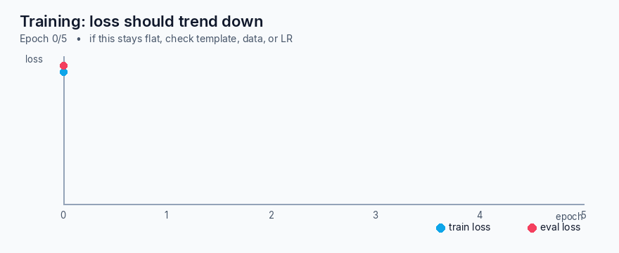

A healthy tiny-data run: loss starts a bit above 2 and steps down. If it does not move, jump to [Troubleshooting](#troubleshooting) before you “just add epochs.”

### Key takeaways

- `SFTTrainer` + a `text` column is the whole training loop for this tutorial.
- Effective batch size = `per_device_train_batch_size * gradient_accumulation_steps * num_gpus`.
- Packing mixes notes into one sequence; leave it off until you know you need it.

---

## Step 8. Save adapter weights

```python
adapter_dir = "outputs/qwen-clinical-lora"
trainer.save_model(adapter_dir)
tokenizer.save_pretrained(adapter_dir)  # copy the *same* tokenizer into the artifact
```

That directory should contain at least:

- `adapter_config.json` — rank, alpha, target modules, base model id
- `adapter_model.safetensors` — the trained `A`/`B` weights
- tokenizer files — so tomorrow’s server cannot “helpfully” pick a different one

Reload later with:

```python
from peft import PeftModel

base, tokenizer = load_model_and_tokenizer(...)  # same model_id as training
model = PeftModel.from_pretrained(base, adapter_dir)
```

### Key takeaways

- Save the tokenizer next to the adapter. Future-you will thank you.
- `adapter_config.json` records the base id — believe it, do not substitute.
- Adapters are swappable: one base, many task adapters.

---

## Step 9. Merge the adapter into the base model

Merging bakes `W' = W + scale * B A` into a single set of weights. Serving stacks like vLLM often prefer this. You **cannot** cleanly merge while the base is still 4-bit; reload in bf16 first.

```python
# only after a bf16 (or fp16) load
merged = model.merge_and_unload()
merged.save_pretrained("outputs/qwen-clinical-lora/merged")
tokenizer.save_pretrained("outputs/qwen-clinical-lora/merged")
```

`train_lora.py --merge` does this and will refuse if you passed `--load-in-4bit`.

Keep the unmerged adapter around. A merged folder is convenient; an adapter is what you iterate on.

### Key takeaways

- Merge is a serving convenience, not a training step.
- Do not merge a 4-bit base in-place.
- Hold on to the adapter even after you merge.

---

## Step 10. Evaluate on held-out data

Evaluation here is not “the loss went down.” It is “on notes the trainer never saw, does the model follow the instruction without inventing a drug?”

```python
import torch

model.eval()
for row in held_out:
    prompt_messages = [m for m in row["messages"] if m["role"] != "assistant"]
    prompt = tokenizer.apply_chat_template(
        prompt_messages, tokenize=False, add_generation_prompt=True
    )
    inputs = tokenizer(prompt, return_tensors="pt").to(model.device)
    with torch.no_grad():
        out = model.generate(**inputs, max_new_tokens=160, do_sample=False)
    pred = tokenizer.decode(out[0][inputs["input_ids"].shape[1]:], skip_special_tokens=True)
    print(row["id"], pred)
```

Then compare `pred` to the stored assistant text. Automatic scores (ROUGE, entity overlap) belong in the [evaluation gate](#4-evaluation-gate) later; for a first run, *read* the four held-out stories.

`python train_lora.py --eval-only --adapter-path outputs/qwen-clinical-lora` reloads an adapter and prints those generations.

### Key takeaways

- Held-out prompts use the same template with `add_generation_prompt=True`.
- Read the samples. A high ROUGE that invents “start warfarin” is a failed model.
- `--eval-only` exists so you do not retrain just to look at outputs.

---

## GPU and memory tips

| Situation | What to try |
| --- | --- |
| 24 GB GPU, 7B | bf16 LoRA, batch 1, `gradient_accumulation_steps=8`, `max_seq_length=1024` |
| 16 GB GPU, 7B | `--load-in-4bit` (QLoRA), same LoRA rank |
| 12 GB or laptop | `Qwen/Qwen2.5-1.5B-Instruct` or `3B` so you can learn the pipeline |
| OOM on compile | `max_seq_length=512`, drop MLP targets, close the browser |
| Multi-GPU | `accelerate launch train_lora.py ...` — still one tokenizer |

Gradient checkpointing (`model.gradient_checkpointing_enable()`) trades compute for memory if you are on the edge. This tutorial does not require paid APIs, hosted notebooks, or a vendor key.

### Key takeaways

- Shrink sequence length before you shrink rank to zero.
- QLoRA is how 7B fits on 16 GB.
- Practice the pipeline on 1.5B if you have no GPU today.

---

## Run the training script

```bash
# no GPU: inspect templates
python train_lora.py --preview

# single GPU, 4-bit
python train_lora.py \
  --model-id Qwen/Qwen2.5-7B-Instruct \
  --load-in-4bit \
  --output-dir outputs/qwen-clinical-lora

# after training
python train_lora.py --eval-only --adapter-path outputs/qwen-clinical-lora
```

The script matches this README: load → template → LoRA → `SFTTrainer` → save → optional merge → held-out generate.

### Key takeaways

- `--preview` is the smoke test you should run in CI.
- Flags exist for rank, alpha, epochs, and 4-bit so the README numbers are not hardcoded forever.
- Output directories belong in `.gitignore` (they already are).

---

## Troubleshooting

| Error / symptom | Likely cause | Concrete fix |
| --- | --- | --- |
| Answers look untrained; model ignores “summarize in 4 bullets” | **Wrong chat template** at serve time (`### Instruction` or missing `<|im_start|>`) | Reload with the training `model_id`. Call `tokenizer.apply_chat_template(..., add_generation_prompt=True)`. Do not hand-format. |
| `ValueError` / crazy Unicode / exploding loss at step 0 | **Tokenizer mismatch** (Llama tokenizer, or a different Qwen size’s vocab) | `AutoTokenizer.from_pretrained` the *same* id as the model. Save that tokenizer in the adapter folder and load it from there. |
| `CUDA out of memory` / `torch.cuda.OutOfMemoryError` | Batch, sequence length, or bf16 7B on a small card | `--load-in-4bit`, `max_seq_length=512`, batch size 1, more accumulation, or a 1.5B/3B model. |
| Loss flat after an epoch | Template missing, LR too low, or you tokenized *without* the assistant text | Print one `train_text` and confirm it ends in the gold answer + `<|im_end|>`. Try `2e-4` for LoRA. Confirm `print_trainable_parameters()` ≠ 0%. |
| `target modules [...] not found` or 0% trainable | Wrong `target_modules` for this architecture | For Qwen2.5 use `q_proj,k_proj,v_proj,o_proj,gate_proj,up_proj,down_proj`. Print `model.named_modules()`. |
| Merge produces garbage / error in 4-bit | Merged a quantized base | Reload adapter onto a bf16 base, then `merge_and_unload`. |
| Eval looks great, production looks lost | Different system prompt or different `add_generation_prompt` | Freeze a `serving_prompt.py` that both eval and vLLM (via chat template) import. |
| `trust_remote_code` scare / custom code | Qwen needs its tokenizer code from the hub | Keep `trust_remote_code=True` for this family, pin the revision if your security team asks. |
| Hallucinated medications on held-out notes | Data taught invention, or temperature > 0 with no grounding | Train with “do not invent facts” examples (we did). Generate with `do_sample=False` for eval. Add an entity-overlap gate. |

### Key takeaways

- Most “LoRA does not work” bugs are template or tokenizer drift.
- OOM is a systems problem; flat loss is a data/template problem.
- Keep a printed example of a *training* string and a *serving* string in the pull request.

---

# Use case 2: Fine-Tuning a Code Model for Your Own Agent Harness

## (1) Scenario

A company today uses **Cursor** with a **third-party hosted model**. That is a good way to move fast. It is a bad way to keep agency over:

- what the model is allowed to see (internal APIs, unreleased product names);
- how it names things (`mask_account_id`, not `foo`);
- where the weights live when legal asks “who trained this, on what.”

They want **their own fine-tuned model** inside a **custom agent harness** — a small program that sends repo context to the model, applies the patch, runs tests, and (later) feeds failures back. Fine-tuning the model and building that harness are **two jobs**. Mixing them up is how teams spend a quarter “on agents” without a single passing unit test.

This section stays on **synthetic** snippets in [`data/example_code_sft.jsonl`](data/example_code_sft.jsonl). Do not dump a proprietary monorepo into a public gist.

## (2) Key differences from clinical notes

Clinical text is allowed to be a little fuzzy (“improving volume status”). Code is not.

| Clinical notes | Internal coding agent |
| --- | --- |
| A missed adjective is a quality miss | A missed comma is a red CI build |
| PHI / HIPAA is the privacy threat | Source code, secrets, and customer data in git history are the threat |
| One note ≈ one example | One change often needs the surrounding *repo* (imports, interfaces, tests) |
| Style guide is SOAP / hospital voice | Style guide is *this* repo’s formatter, names, and error types |

Where the training pairs come from (after you strip secrets):

- a **cleaned** checkout (no `.env`, no PEM files, no production dumps);
- `git log` + diffs, using the **commit message** as the instruction and the patch as the answer;
- PR titles, descriptions, and **review comments** (“Map `IntegrityError` to HTTP 409”);
- issue threads that closed with a known good PR;
- **test files paired with the implementation that made them pass**.

### Key takeaways

- Exact syntax and in-repo conventions matter more than fluent English.
- Git history is a dataset only after you have stripped credentials.
- Tests-plus-implementation pairs are gold; raw files without a task are weak.

## (3) Base-model comparison for code

| Model | Sizes (typical) | Languages | License | Notes |
| --- | --- | --- | --- | --- |
| **Qwen2.5-Coder** | 1.5B / 7B / 14B / 32B Instruct | Strong on Python, JS/TS, Java, C++, Go, and more | Apache 2.0 | Same chat template family as use case 1; excellent PEFT support |
| **DeepSeek-Coder** | 1.3B / 6.7B / 33B (V2/V3 differ) | Very strong competitive-programming + repo tasks | DeepSeek license (check the card) | Great quality; confirm license and chat format before you copy this script |
| **StarCoder2** | 3B / 7B / 15B | Broad multi-lingual (The Stack v2) | BigCode OpenRAIL-M | Fill-in-the-middle is a first-class story; instruction variants vary |
| **CodeLlama** | 7B / 13B / 34B (Instruct / Python) | Strong Python; older than the others | Llama license | Still fine; you inherit an older tokenizer and a different prompt style |

> **Recommendation.** For an **internal coding agent**, start with **`Qwen/Qwen2.5-Coder-7B-Instruct`**. You stay on Apache 2.0, you can reuse this repo’s LoRA + `apply_chat_template` discipline (same family as the clinical tutorial), and 7B Instruct is large enough to learn house style without demanding a multi-GPU pod. Move to 14B/32B only after your *harness* and *unit-test eval* are in place — a bigger base will not fix a missing test runner.

### Key takeaways

- Pick the Instruct checkpoint, not a raw completion checkpoint, if the harness talks in chats.
- License and template compatibility beat a 1-point HumanEval bump.
- Stay on 7B until the evaluation loop is real.

## (4) Training approach (still LoRA; the *data* changes)

Keep LoRA. Change the examples.

### Code completion / fill-in-the-middle (FIM)

The model sees a prefix and a suffix and must write the gap. This is how editors feel.

```python
fim = {
    "prompt": (
        "<|fim_prefix|>def parse_iso_date(value: str) -> date:\n"
        '    """Parse YYYY-MM-DD. Raise ValueError on bad input."""\n'
        "    <|fim_suffix|>\n"
        '    return datetime.strptime(value, "%Y-%m-%d").date()\n'
        "<|fim_middle|>"
    ),
    "completion": "    if not value:\n        raise ValueError(\"empty date\")\n",
}
# Train on prompt + completion as one causal sequence, still via the
# model's documented FIM tokens — not a second homemade syntax.
```

Use the **model card’s** FIM tokens for Qwen2.5-Coder. If you invent new ones, you are back to template drift.

### Instruction-following coding tasks

Same `messages` schema as clinical SFT:

```python
{
  "messages": [
    {"role": "system", "content": "You are an internal coding assistant for Acme Ledger. Follow existing names."},
    {"role": "user", "content": "Add mask_account_id in ledger/privacy.py and a pytest."},
    {"role": "assistant", "content": "```python\n# ledger/privacy.py\ndef mask_account_id(...)\n```"},
  ]
}
```

This is how you teach “when a human asks in English, emit a patch that matches our tree.”

### Repository-level context tasks

Give the model the review comment + the relevant file heads, ask for the smallest change:

```python
user = """PR review on payments_api/routes.py:
'Do not return raw SQLAlchemy errors to clients. Map IntegrityError to HTTP 409.'
Repo convention: FastAPI + structlog. Write the smallest handler and name the test.
"""
```

You will not fit the whole monorepo in 1024 tokens. Retrieve the *right* files (the harness’s job) and fine-tune on *realistic slices* (the model’s job).

### Key takeaways

- FIM teaches “fill the blank”; instruction SFT teaches “obey a ticket”; repo tasks teach “obey a review.”
- LoRA hyper-parameters can stay at `r=16`, `alpha=32` until data says otherwise.
- Token budget is now a product decision: what the harness stuffs into the prompt is what you must train on.

## (5) Agent harness explained

The loop is older than the word “agent”:

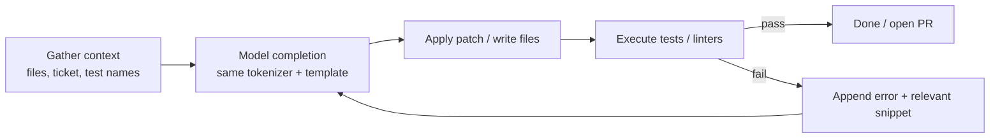

Two efforts, on purpose:

| Effort | Owns | Does not own |
| --- | --- | --- |
| **Fine-tune** | Weights that know your names, APIs, and review style | Running pytest, editing the workspace |
| **Harness** | Context packing, tool calls, retries, secrets, CI | “Being smart” about a language it never saw |

**Start with a minimal single-turn harness.** One shot: pack context, ask for a patch, run tests, stop. Log the failures. Those logs become the next SFT file. Only then add multi-turn “try again with the traceback” behavior. A multi-turn agent on a model that cannot pass `test_mask_account_id` is an expensive loop.

Pseudo-harness (single turn):

```python
def single_turn(ticket: str, files: dict[str, str], tokenizer, model) -> str:
    messages = [
        {"role": "system", "content": "Return a unified diff. Do not explain."},
        {"role": "user", "content": format_ticket_and_files(ticket, files)},
    ]
    prompt = tokenizer.apply_chat_template(
        messages, tokenize=False, add_generation_prompt=True
    )
    # generate → apply_diff → subprocess.run(["pytest", "-q"])
    return prompt
```

Notice the same `apply_chat_template` call. The harness is inference. Inference uses the training template.

### Key takeaways

- Context → complete → execute → (optionally) feedback.
- Fine-tuning ≠ harness. Staff them as separate workstreams.
- Single-turn + unit tests first; multi-turn later.

## (6) Evaluation

Hosted-model vibes are not an eval.

| Signal | How to measure | Why it matters |
| --- | --- | --- |
| **Unit test pass rate** | Hidden internal tasks: given a ticket, did `pytest` go green? | The only metric your CI believes |
| **Human eval** | 10–20 real internal tickets, scored by the team that owns the code | Catches “tests passed, API is ugly” |
| **Cursor baseline** | Same tickets, same harness, third-party model vs your adapter | Tells you whether to switch traffic |

Hold the **harness** constant when you compare models. If you change the prompt packer and the weights on the same day, you will not know which one won.

### Key takeaways

- Pass rate on *your* tests beats HumanEval screenshots.
- Compare against the current Cursor+vendor setup on the same ticket pack.
- Freeze the harness when you A/B the adapter.

## (7) Recommendation box

> **Recommendation (model + LoRA + harness staging).** Train **LoRA (`r=16`, `alpha=32`)** on **`Qwen2.5-Coder-7B-Instruct`** using a mix of FIM, instruction, and review-comment pairs mined from a *cleaned* internal history. Ship a **single-turn** harness that already uses `tokenizer.apply_chat_template` and pytest as the judge. Promote the adapter only when it beats the current Cursor baseline on that hidden ticket pack. Add multi-turn error feedback after — not before — the single-turn pass rate is something you would show your staff engineer.

### Git-history-to-training-data pipeline

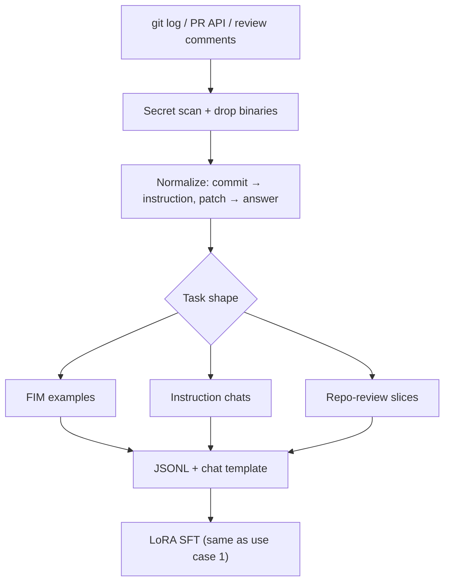

### Key takeaways

- Qwen2.5-Coder-7B-Instruct + LoRA is the default for this use case.
- Data hygiene (secrets, license, tests) is the hard part.
- The harness stays dumb and deterministic until the model earns retries.

---

# MLOps Pipeline: Automating the Full Lifecycle

Fine-tuning once is a tutorial. A **pipeline** is what you run the week a new bundle of (still de-identified, still synthetic in this repo) notes lands and nobody wants to SSH into the GPU box.

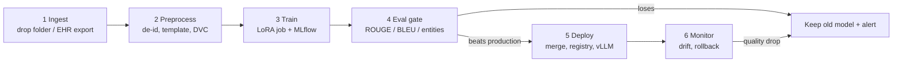

Teaching implementations live under [`mlops/`](mlops/). They operate on the fake JSONL only.

> **Privacy again.** An “EHR connector” in a blog post is not permission to pull the real EHR. Production ingest needs a BAA where applicable, least-privilege credentials that are **not** in git, de-identification *before* any training VM, and an audit log. The snippets below use a local folder named `data/` that already contains synthetic rows.

---

## (1) Data ingestion

**What.** On a schedule, copy new notes from a source (SFTP drop, warehouse export, object bucket) into a dated, content-addressed raw folder. Deduplicate identical lines. Write a manifest with a SHA-256 so you can prove what the job saw.

**What not.** Do not `git add` the raw drop. Do not log note text to stdout in production.

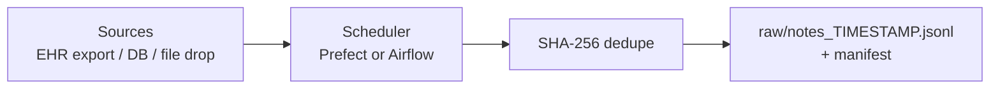

Prefect-shaped schedule (pattern only):

```python
# pip install prefect  — optional; cron calling mlops/ingest.py is enough
from prefect import flow, task
from pathlib import Path
from mlops.ingest import ingest

@task
def pull_drop():
    return ingest(Path("data"), Path("mlops/var/raw"))

@flow(name="clinical-ingest")
def ingest_flow():
    path = pull_drop()
    print("versioned raw file:", path)

# ingest_flow.serve(cron="0 6 * * *")   # 06:00 UTC, after the nightly export
```

Or just:

```bash
python mlops/ingest.py --drop-dir data --raw-dir mlops/var/raw
```

Airflow is the same graph: a `PythonOperator` that calls `ingest()` and an `ExternalTaskSensor` if you must wait on the EHR dump. Pick Airflow when you already run it; do not adopt it for one file copy.

### Key takeaways

- Ingest writes **versioned raw files**, not “whatever is in `latest.json`.”
- Dedup at the line hash so a re-drop does not double-train.
- Real EHR access is a compliance project; this repo only shows the file-drop pattern.

---

## (2) Data preprocessing

**What.** Turn raw (still synthetic here) notes into the exact strings the trainer will see: light cleanup, instruction pairs, **Qwen chat template**, optional tokenization, store a **versioned** processed dataset.

**Privacy.** If a row is not marked `synthetic: true`, [`mlops/preprocess.py`](mlops/preprocess.py) exits. That is the teaching stand-in for “this row still has PHI — stop.” In a real stack, de-identification (dates shifted, names replaced, MRNs hashed) happens **before** this VM, and the redacted text is what you template.

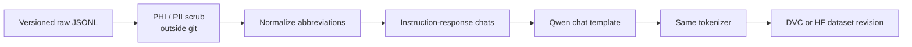

```python
from mlops.preprocess import apply_qwen_template, normalize_abbreviations

messages = [
    {"role": "system", "content": "You are a careful clinical documentation assistant. ..."},
    {"role": "user", "content": normalize_abbreviations(user_text)},
    {"role": "assistant", "content": normalize_abbreviations(answer)},
]
text = apply_qwen_template(messages, add_generation_prompt=False)
# Production: tokenizer.apply_chat_template(messages, tokenize=False, ...)
```

Versioning options:

```bash
# DVC (small team, files stay in your bucket)
dvc add mlops/var/processed/clinical_sft.jsonl

# Hugging Face Datasets (private dataset, not the public Hub with PHI)
# datasets.Dataset.from_json(...).push_to_hub("your-org/clinical-sft-synth", private=True)
```

Never commit the processed file if it ever touched real notes. The example command is safe because it reads `data/example_clinical_sft.jsonl`:

```bash
python mlops/preprocess.py \
  --src data/example_clinical_sft.jsonl \
  --dest mlops/var/processed/clinical_sft.jsonl
```

### Key takeaways

- Preprocess **is** where the chat template is applied. Do not re-invent it in the trainer.
- Version the processed set; “whatever was on the GPU box” is not a dataset.
- Refuse to process unmarked, potentially-real rows.

---

## (3) Training trigger

**What.** When DVC says the processed dataset changed, or when the calendar says Friday, start a LoRA job on a GPU node. Log hyperparameters, dataset hash, and metrics to **MLflow** or **Weights & Biases**.

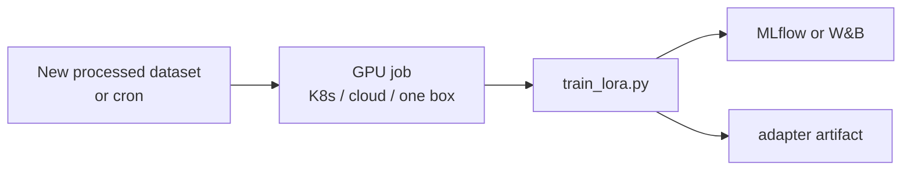

```python
import mlflow
import subprocess
from pathlib import Path

def kick_off_training(data: Path, output: Path, dataset_hash: str) -> None:
    with mlflow.start_run(run_name="qwen-clinical-lora"):
        mlflow.log_params({
            "model_id": "Qwen/Qwen2.5-7B-Instruct",
            "lora_r": 16,
            "lora_alpha": 32,
            "dataset_hash": dataset_hash,
            "chat_template": "qwen-instruct-apply_chat_template",
        })
        subprocess.check_call(
            [
                "python", "train_lora.py",
                "--data", str(data),
                "--output-dir", str(output),
                "--load-in-4bit",
            ]
        )
        mlflow.log_artifacts(str(output), artifact_path="adapter")
```

A Kubernetes `Job` is the same command with a GPU request. A Cloud GPU VM is the same command in a startup script. You do not need a new trainer — you need a **trigger** around `train_lora.py`.

### Key takeaways

- Trigger on **data change** or schedule, not on “someone remembered.”
- Log the dataset hash and the template name or you cannot reproduce a win.
- The training code stays ordinary Python; the platform just starts it.

---

## (4) Evaluation gate

**What.** Score the new adapter against the **current production** model on a frozen held-out set. Promote only if the candidate **wins every key metric**.

Metrics that belong on a clinical-note gate:

| Metric | What it roughly means | Careful with |
| --- | --- | --- |
| **ROUGE-L** | Longest common subsequence vs the reference write-up | Rewording a good plan looks “worse” |
| **BLEU** | n-gram overlap | Same problem; use as a *regression* check, not a clinical truth |
| **Clinical entity overlap** | Did diagnoses / meds in the reference appear (and did extras appear)? | The useful one; maintain a reviewed lexicon |
| **LLM-as-judge rubric** | A second model grades “grounded / complete / no extra meds” | Never the only gate; judges hallucinate too |

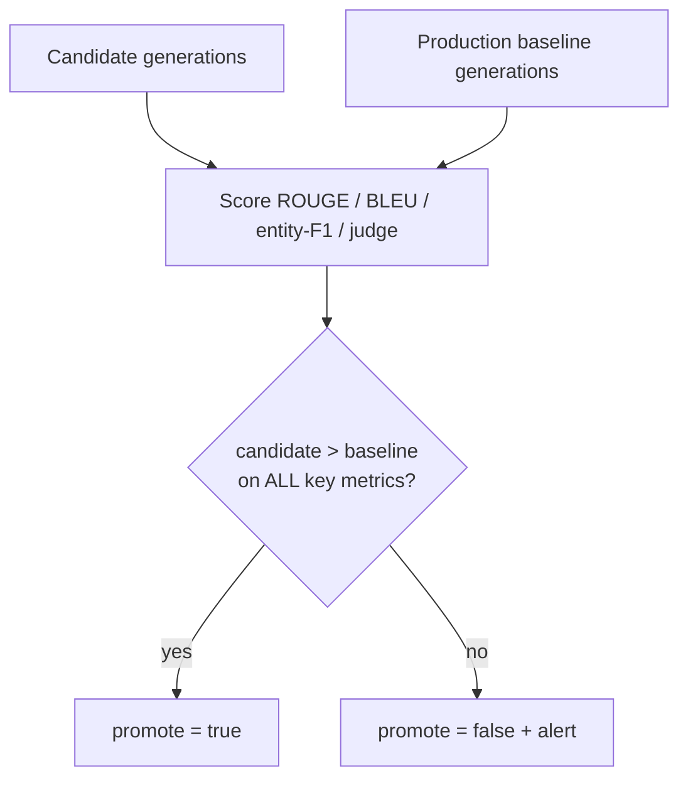

```bash
python mlops/eval_gate.py \
  --candidate data/example_eval_candidate.jsonl \
  --baseline data/example_eval_baseline.jsonl \
  --report mlops/var/eval_report.json
```

[`mlops/eval_gate.py`](mlops/eval_gate.py) implements cheap stand-ins for ROUGE-L, a BLEU-ish score, and medication/diagnosis overlap. Exit code `2` means “do not deploy.” In production, generate the two JSONL files with **the same tokenizer and chat template** you trained with, then add a small rubric:

```python
RUBRIC = """Score 0-3 on: (a) every med/problem in the note is preserved,
(b) nothing new is invented, (c) the requested format is followed.
Return JSON {a,b,c,total}. The note is synthetic."""
```

A judge that is allowed to override entity-F1 is how invented drugs sneak into production. Keep the hard rule: **entity overlap and “no extra meds” cannot lose.**

### Key takeaways

- The gate compares to **production**, not to “looks nicer to the author.”
- Win on *all* key metrics or stay put.
- LLM-as-judge is a comment, not a license to skip entity checks.

---

## (5) Conditional deployment

**What.** If `promote` is true: merge the LoRA adapter (bf16), push a **model registry** tag, point the serving endpoint (vLLM or TGI) at it. If false: leave traffic on the old tag and page a human.

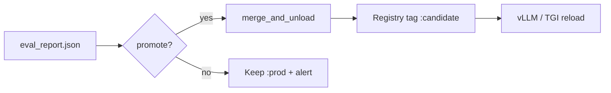

```python
from pathlib import Path
from mlops.deploy_and_monitor import deploy_if_promoted

deploy_if_promoted(
    report_path=Path("mlops/var/eval_report.json"),
    adapter_dir=Path("outputs/qwen-clinical-lora"),
    registry_uri="file://mlops/var/registry/clinical-qwen",
)
```

Serving (after a real merge, on a GPU host you control):

```bash
# vLLM reads the merged folder or base+adapter depending on version
vllm serve outputs/qwen-clinical-lora/merged --max-model-len 4096

# or TGI
text-generation-launcher --model-id outputs/qwen-clinical-lora/merged
```

Both must load the tokenizer that sits **in that folder**. If you point vLLM at the generic Hub id and then “just paste” prompts without the Qwen chat template, you have broken the golden rule at the last mile.

### Key takeaways

- Deploy is a **branch**, not a default.
- Registry tags (`:prod`, `:candidate`) make rollback a pointer change.
- The server uses the same template as `SFTTrainer`.

---

## (6) Monitoring

**What.** After traffic moves, watch **input drift** (notes getting longer, new departments, a new EHR vendor’s export format) and **output quality** (entity-F1 on a rolling human-labeled sample, rate of empty answers, rate of “start warfarin” when warfarin was not in the note). If quality drops under a floor, **roll back automatically** and alert.

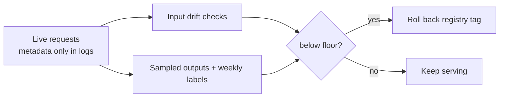

```python
from pathlib import Path
from mlops.deploy_and_monitor import monitor_and_maybe_rollback

# live_scores.json is computed by a nightly job on *sampled, permitted* text
monitor_and_maybe_rollback(Path("mlops/var/live_scores.json"), floor=0.55)
# prints either "healthy" or "DRIFT ... kubectl rollout undo ..."
```

Do not write raw clinical text into an unsecured metrics system. Log hashes, lengths, department codes, and scores. Keep the actual note in the system that is already allowed to hold it.

### Key takeaways

- Monitoring is part of the model, not a dashboard you might build later.
- Automatic rollback needs a still-good `:prod-previous` tag.
- Drift in the *template* (a client stops sending the system prompt) shows up as quality collapse — treat that as an incident.

---

## Tooling recommendation: small team vs larger org

| Stage | Small team (this tutorial’s default) | Larger org |
| --- | --- | --- |
| Ingest | Prefect, or cron + `mlops/ingest.py` | Airflow / cloud composer, VPC-only EHR exports |
| Preprocess + version | DVC on an encrypted bucket | Feature store + private HF dataset + legal hold |
| Train | One GPU box, `train_lora.py`, MLflow local | K8s Job / Slurm, W&B, spot GPUs |
| Gate | `mlops/eval_gate.py` + a human reading 20 notes | Dedicated eval service, clinician review queue |
| Deploy | vLLM on that same box, file-based registry | TGI/vLLM on K8s, Model Registry, canary 5% |
| Monitor | Nightly script + Slack | Observability stack, on-call, automated rollback |

> **Recommendation.** A small team should **not** start with Kubernetes. Run Prefect or cron, DVC, MLflow, `train_lora.py`, the eval gate, and vLLM on one locked-down GPU machine. A larger org should add Airflow, a real registry, canaries, and a **human clinical review** step — no automated gate is a medical-device substitute. In both cases the model stays LoRA-on-Qwen2.5-7B-Instruct until the pipeline is boring.

### Key takeaways (whole MLOps section)

- The happy path is ingest → preprocess (template!) → train → **gate** → deploy → monitor → rollback.
- The sad path (gate fail or drift) is **keep the old model** and tell a human.
- Same tokenizer, same chat template, at every stage including vLLM.
- Synthetic patterns only in this repo; real PHI never lands in git.
- Small teams: Prefect + DVC + MLflow + vLLM. Larger orgs: Airflow + K8s + registry + clinician review.

---

## License and research-only reminder

- Code in this repository: [MIT](LICENSE).
- Qwen2.5 weights: Apache 2.0 (see the model card).
- Llama / DeepSeek / StarCoder / NVIDIA checkpoints: *their* licenses, not MIT.
- **Research only.** Do not file this adapter as a medical device, a diagnostic aid, or a coder that merges to `main` unreviewed.

If you take one thing: **the tokenizer and the chat template are part of the model.** Train, evaluate, and serve them as a triple, or the rest of the pipeline is theater.
