# LLM hyperparameters: the recipe settings

> This page lives in the [Qwen LoRA clinical-notes tutorial](../../README.md) at `docs/hyperparameters/`. The standalone `llm-hyperparameters-guide` repo is archived here so the full knob-by-knob walkthrough stays next to the training recipe.

A beginner-friendly guide to the knobs you turn **after** you already have a base model and a dataset. The long version lives in this README (it *is* the blog post). A shorter narrative is in [BLOG.md](BLOG.md). The looping GIFs regenerate from [`scripts/generate_hyperparameter_gifs.py`](../../scripts/generate_hyperparameter_gifs.py).

If you have already picked something like `Qwen/Qwen2.5-7B-Instruct` and a folder of instruction chats, you are not done. Those two things are the **ingredients**. Hyperparameters are the **recipe**: how hot the oven is, how long you bake, how thin you slice the adapter, and — later, when nobody is training anything — how adventurous the model is allowed to be when it talks.

Three things people mix up on day one:

| Thing | What it is | What it is not |
| --- | --- | --- |
| **Base model weights** | The published checkpoint. Billions of numbers you usually freeze. | A hyperparameter. You do not “set Qwen to 0.7.” |
| **Dataset** | The chats / completions the trainer sees. | A hyperparameter. `r=16` will not fix a messy JSONL. |
| **Hyperparameters** | Numbers and names that change *how* training or sampling runs. | The intelligence of the model. They steer a process; they are not the process. |

> **License.** Tutorial text, GIFs, and scripts in this repo are [MIT](../../LICENSE). Model weights you fine-tune later keep their own licenses.

---

## Table of contents

1. [What you will learn](#what-you-will-learn)
2. [Train vs inference: two different dashboards](#train-vs-inference-two-different-dashboards)
3. [When to tune what](#when-to-tune-what)
4. [Sensible defaults](#sensible-defaults)
5. [Training / fine-tuning hyperparameters](#training--fine-tuning-hyperparameters)
   - [Learning rate](#learning-rate)
   - [Batch size and gradient accumulation](#batch-size-and-gradient-accumulation)
   - [Epochs](#epochs)
   - [Warmup ratio](#warmup-ratio)
   - [Weight decay](#weight-decay)
   - [Optimizer](#optimizer)
   - [LoRA rank (`r`)](#lora-rank-r)
   - [LoRA alpha](#lora-alpha)
   - [LoRA dropout](#lora-dropout)
   - [Target modules](#target-modules)
   - [Max sequence length](#max-sequence-length)
6. [Inference-time hyperparameters](#inference-time-hyperparameters)
   - [Temperature](#temperature)
   - [Top-p (nucleus)](#top-p-nucleus)
   - [Top-k](#top-k)
   - [Max tokens / `max_new_tokens`](#max-tokens--max_new_tokens)
   - [Stop sequences](#stop-sequences)
7. [How the knobs interact](#how-the-knobs-interact)
8. [Troubleshooting](#troubleshooting)
9. [Where each knob appears in code](#where-each-knob-appears-in-code)
10. [Regenerating the GIFs](#regenerating-the-gifs)
11. [License](#license)

---

## What you will learn

By the end of this page you can:

- Tell a **training** knob from an **inference** knob without squinting at the API.
- Read a `TrainingArguments` + `LoraConfig` block and know which line to touch first.
- Read a `model.generate(...)` call and know why the reply is bland, wild, cut off, or stuck in a loop.
- Name a typical range, a common mistake, and one interaction for every parameter listed below.
- Point at a symptom (NaN loss, OOM, repetition, truncation) and name the hyperparameter that usually caused it.

Jargon, once:

- **SFT** — supervised fine-tuning. Show complete answers; train the model to write them.
- **LoRA** — Low-Rank Adaptation. Freeze `W`, train two thin matrices `A` and `B`, add `scale · B A` to the layer.
- **Effective batch size** — `per_device_batch × devices × gradient_accumulation_steps`.
- **Sampling** — turning a next-token probability distribution into one actual token.
- **Context window** — how many tokens the model can see at once. `max_seq_length` is the *training* budget inside that window.

### Key takeaways

- Hyperparameters are recipe settings. They are not the flour and they are not the oven’s brand name.
- Training knobs change **weights**. Inference knobs change **sampling** from a fixed model.
- One good default set beats a weekend of random search.

---

## Train vs inference: two different dashboards

Write this on a sticky note:

**Training knobs shape the weights. Inference knobs shape sampling from a model that is no longer learning.**

Nothing you type into `generate` writes back into the adapter. Nothing you type into `LoraConfig` makes tonight’s chatbot more or less “creative.” People still slide `temperature` during a fine-tune and wonder why the loss did not move.

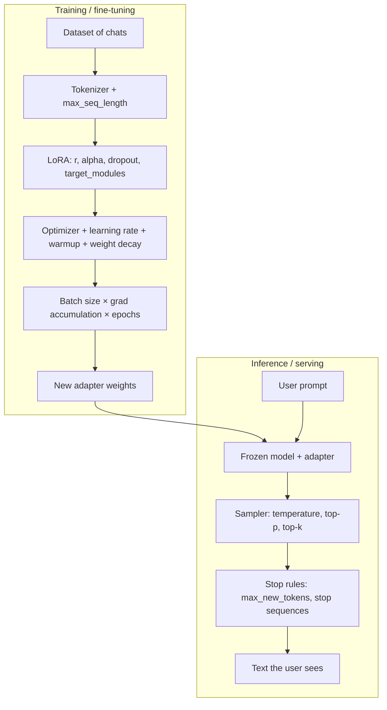

A useful split when you are stuck:

| Question | Dashboard |
| --- | --- |
| “The model never learned the SOAP format.” | Training |
| “Loss is NaN after step 12.” | Training |
| “It learned the format but tonight it rambles.” | Inference |
| “It cuts off mid-sentence.” | Almost always inference (`max_new_tokens`) — unless training truncated the answers |
| “It repeats ‘Sure, sure, sure’.” | Inference first (temperature / penalties); data second |

### Key takeaways

- The adapter file is the product of training. Sampling is a live choice on top of that file.
- Debug with the dashboard that actually owns the symptom.
- Keep a written default for *each* dashboard so you do not retune both at once.

---

## When to tune what

Do not spin every dial. Most quality comes from **data + template + a boring default recipe**. Use this table to decide whether a knob is worth a run.

| Knob | When it is worth touching | When it is a distraction | First thing to try |
| --- | --- | --- | --- |
| Learning rate | Loss is flat, exploding, or the adapter does nothing | You have not confirmed the chat template | `2e-4` LoRA / `1e-4` if unstable |
| Batch size / accumulation | GPU is idle, or grads are so noisy eval jitters | You are already at a stable effective 8–32 | Raise **accumulation**, not micro-batch |
| Epochs | Tiny dataset underfits after 1 pass, or val loss is rising | You are using epochs to “make up for” bad data | 1–3, watch held-out loss |
| Warmup ratio | First steps spike loss / grad norm | Long runs on huge data (warmup still fine at 3%) | `0.03` |
| Weight decay | Adapter memorizes a small set | You already have dropout + small `r` | `0.0`–`0.01` |
| Optimizer | You have a reason to leave AdamW | “Maybe Lion will save this dataset” | `adamw_torch` |
| LoRA rank | Format is right but facts / style are thin | Rank 64 on 80 toy rows | `16`, then `32` |
| LoRA alpha | Rank is fine, updates feel too shy or too loud | You change alpha *and* LR every run | `alpha = 2r` |
| LoRA dropout | Overfitting a small SFT set | Huge clean corpus | `0.05` |
| Target modules | 0% trainable, or attention-only underfits | Guessing module names from another family | Qwen: attn + MLP |
| Max sequence length | Answers are chopped in the *training* text | Setting 8192 “just in case” and OOMing | Fit the 95th-percentile example |
| Temperature | Replies are dull or chaotic | Using it as a substitute for better prompts | `0.7` chat, `0`–`0.2` extractive |
| Top-p | You want a probability budget, not a vibe | Tuning p and k and T together | `0.9`, leave k alone |
| Top-k | You need a hard vocabulary cap | Fighting top-p with a tiny k | `50` or disable |
| Max new tokens | Cutoffs, or runaway essays | Raising it to hide a missing stop rule | Size to the task |
| Stop sequences | Model keeps talking past a marker | A stop string that appears *inside* good answers | EOS + your harness marker |

> **Recommendation.** Change **one** training knob per run, and do not retune inference until a held-out eval says the weights actually moved. If you change data, template, rank, and temperature on the same afternoon, you will not know which one won.

---

## Sensible defaults

Two recipes this guide treats as the boring, correct starting point. Steal them, then change one thing.

> **Recommendation (LoRA SFT on a 7B instruct model).** For a single-GPU supervised fine-tune of something like `Qwen/Qwen2.5-7B-Instruct` on a few hundred to a few thousand chats: **`learning_rate=2e-4`**, **`per_device_train_batch_size=1`**, **`gradient_accumulation_steps=8`** (effective batch 8; 16 if VRAM allows), **`num_train_epochs=2`**, **`warmup_ratio=0.03`**, **`weight_decay=0.01`**, **`optim="adamw_torch"`**, **`r=16`**, **`lora_alpha=32`**, **`lora_dropout=0.05`**, **target attention + MLP**, **`max_seq_length=1024`** (2048 only if your chats actually need it). bf16 if the GPU has it; QLoRA 4-bit if 7B does not fit. Do not start at rank 64.

> **Recommendation (chat inference).** After the adapter exists: **`temperature=0.7`**, **`top_p=0.9`**, **`top_k=50`** (or omit / 0 if your stack treats that as “off”), **`max_new_tokens=512`**, stop on the model’s **EOS** plus any harness marker (`\n\nUser:`, `</s>`, `<|im_end|>` — *the ones your template actually emits*). For JSON, classification, or “extract the meds,” drop temperature to **`0.0–0.2`** and keep the stop list strict. Do not debug a bad adapter by cranking temperature to 1.3.

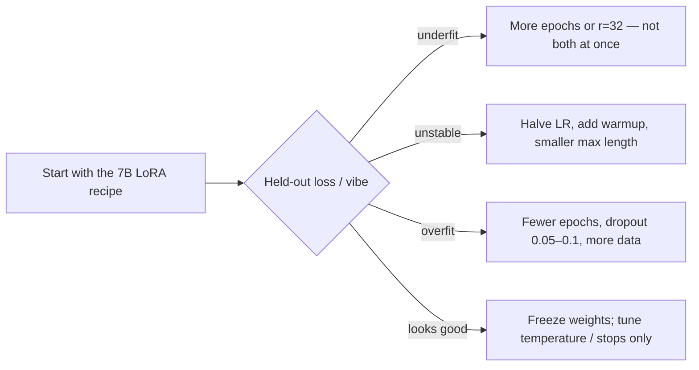

### Key takeaways

- Effective batch 8–16 and LR `2e-4` is the LoRA SFT groove for 7B.
- `alpha = 2r` means you can think in rank and ignore scale for a while.
- Inference defaults are a product decision, not a second training run.

---

# Training / fine-tuning hyperparameters

These knobs live in `TrainingArguments`, `SFTConfig`, and `LoraConfig`. They change how the optimizer writes the adapter.

---

## Learning rate

**What it is.** The step size. Each update is roughly `weight ← weight − lr × gradient` (the optimizer dresses that up; the idea stays).

**What it controls.** How violently the adapter moves after every step. Too high and you jump over the useful region — loss spikes, oscillates, or becomes NaN. Too low and you spend the whole job tiptoeing; the model still sounds like the base checkpoint.

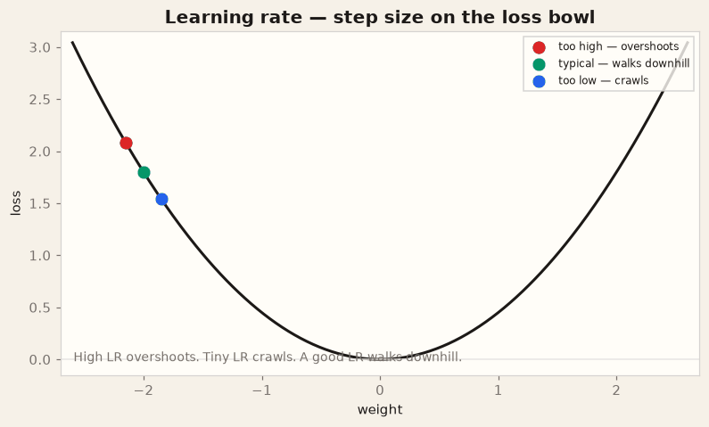

**Typical ranges.**

| Setup | Starting LR | Notes |
| --- | --- | --- |
| LoRA / QLoRA SFT on 7B | `1e-4` – `3e-4` | **`2e-4` is the default in this guide** |
| LoRA on 13B–14B | `5e-5` – `2e-4` | Start lower than 7B if the first steps spike |
| Full fine-tune of 7B | `5e-6` – `2e-5` | You are moving *all* weights; be timid |
| Embedding-only / tiny heads | `1e-3` – `5e-3` | Not the usual instruct-SFT path |

**Common mistakes.**

- Using a full-finetune LR (`1e-5`) on LoRA and concluding “LoRA does not work.”
- Using a LoRA LR (`2e-4`) on a full 7B train and concluding “AdamW is broken” after the NaNs.
- Comparing two LRs on different effective batch sizes (see below).
- Reading “cosine schedule” in a blog and forgetting that the **peak** is still this number.

**Interactions.** Learning rate × effective batch size is the pair that actually matters. Linear scaling (“double batch, double LR”) is a *starting heuristic*, not a law, and it is easy to overshoot on small SFT sets. Learning rate × warmup decides whether step 0 is a shove. Learning rate × LoRA alpha both scale the adapter update: turning both up is one knob in disguise.

```python
from transformers import TrainingArguments

args = TrainingArguments(
    output_dir="out/adapter",
    learning_rate=2e-4,          # peak LR; the schedule starts at ~0 after warmup
    lr_scheduler_type="cosine",
    num_train_epochs=2,
    per_device_train_batch_size=1,
    gradient_accumulation_steps=8,
    bf16=True,
    logging_steps=10,
)
```

### Key takeaways

- LoRA likes a **larger** LR than full fine-tuning.
- Flat loss → raise LR (or you are not training what you think). Exploding loss → cut LR in half.
- Do not retune LR and alpha in the same run.

---

## Batch size and gradient accumulation

**What it is.** How many examples contribute to one optimizer step. Hardware batch (`per_device_train_batch_size`) is what fits in VRAM. **Gradient accumulation** runs `k` of those micro-batches, adds the gradients, and *then* steps. Effective batch = `micro-batch × devices × k`.

**What it controls.** The noise in the gradient estimate. Tiny batches point a different direction every step — the walk is jittery, eval scores bounce. Huge batches are smoother and use the GPU better, but on a small dataset you get very few updates per epoch.

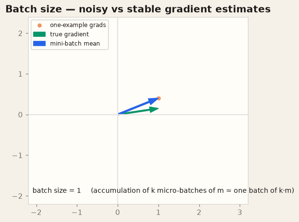

**Typical ranges.**

| Piece | 7B LoRA on one 24 GB GPU | Why |
| --- | --- | --- |
| `per_device_train_batch_size` | `1` or `2` | Long chats + bf16 (or 4-bit) fill the card |
| `gradient_accumulation_steps` | `8` or `16` | Buys a sane effective batch without OOM |
| Effective batch | `8` – `32` | Sweet spot for small/medium SFT |
| Multi-GPU | Keep *effective* in that band | Do not accidentally 8× the batch because you 8× the GPUs |

**Common mistakes.**

- Raising micro-batch until OOM, instead of accumulating.
- Forgetting that accumulation **does not** use more activation memory. It uses more *time* per step.
- Changing batch size and then “the old LR is now wrong” without noticing.
- Setting accumulation to 32 on 80 examples: you take two steps per epoch and learn almost nothing.

**Interactions.** Batch size × learning rate (noise vs step size). Batch size × epochs (same data, fewer updates if the batch is huge). Batch size × `max_seq_length` (memory is roughly linear in both). Gradient checkpointing is the other memory lever — use it before you shrink the batch to 1 *and* drop MLP targets.

```python
args = TrainingArguments(
    per_device_train_batch_size=1,   # what fits
    gradient_accumulation_steps=8,   # 1 × 8 = effective 8
    gradient_checkpointing=True,
)
# effective_batch = 1 * n_gpus * 8
```

### Key takeaways

- Accumulate to the effective batch you wanted. Do not worship a large micro-batch.
- Memory crisis: shrink **sequence length** or micro-batch, not the idea of batching.
- Very small datasets want *more steps*, which means a modest effective batch.

---

## Epochs

**What it is.** How many times the trainer walks the **entire** training set. `max_steps` is the same idea measured in optimizer updates. Prefer whichever one you will actually look at on the progress bar.

**What it controls.** How much the adapter is allowed to memorize this particular JSONL. One epoch on a huge, diverse corpus is often enough. Three epochs on 200 near-duplicate chats is how you get a model that only knows those 200 answers.

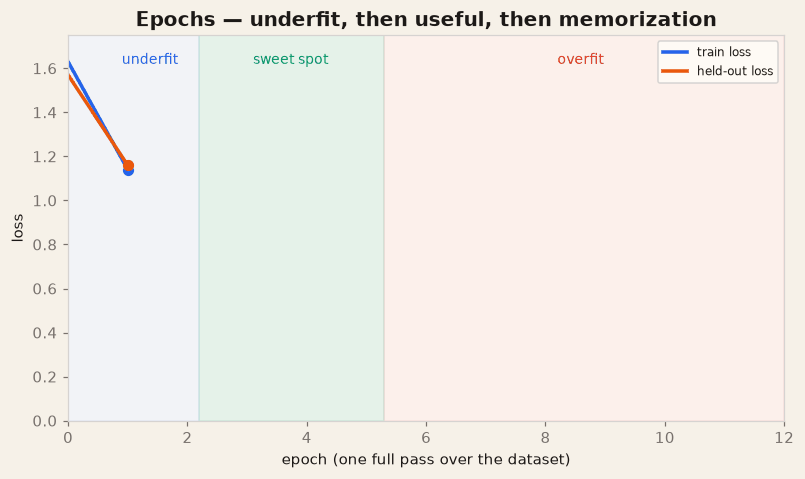

**Typical ranges.**

| Data | Epochs | Notes |
| --- | --- | --- |
| A few hundred curated chats | 2–4 | Watch a held-out split; 1 is often underfit |
| A few thousand varied chats | 1–2 | Default **2** in this guide |
| Tens of thousands+ | 1 | Then iterate on *data*, not extra epochs |
| Tiny demo (≤50 rows) | 3–5 | Teaching only; it will memorize |

**Common mistakes.**

- “Five more epochs” as a substitute for more diverse examples.
- No held-out split, so you never see the orange curve in the GIF.
- Mixing a new dataset version with a new epoch count on the same day.
- Using `max_steps=100` *and* `num_train_epochs=3` without reading which one your trainer honors.

**Interactions.** Epochs × dataset size = total updates (given a batch). Epochs × LoRA rank × dropout: more capacity + more passes = faster memorization. Early stopping on held-out loss is how adults leave this knob alone.

```python
args = TrainingArguments(
    num_train_epochs=2,
    eval_strategy="epoch",
    save_strategy="epoch",
    load_best_model_at_end=True,
    metric_for_best_model="eval_loss",
)
```

### Key takeaways

- Epochs are passes over **your** data, not a universal “training time.”
- The useful region is where held-out loss is still falling or flat.
- Stop when the orange curve turns up, even if train loss looks heroic.

---

## Warmup ratio

**What it is.** The fraction of **total training steps** spent linearly ramping the learning rate from ~0 to the peak. `warmup_ratio=0.03` on 1000 steps means “30 steps of gentle acceleration.” `warmup_steps` is the same idea as an absolute count.

**What it controls.** Whether the first updates — when gradients are noisiest and the adapter is random — take a full-size jump. Warmup is cheap insurance against an early loss spike. After warmup, a cosine (or linear) decay usually takes over.

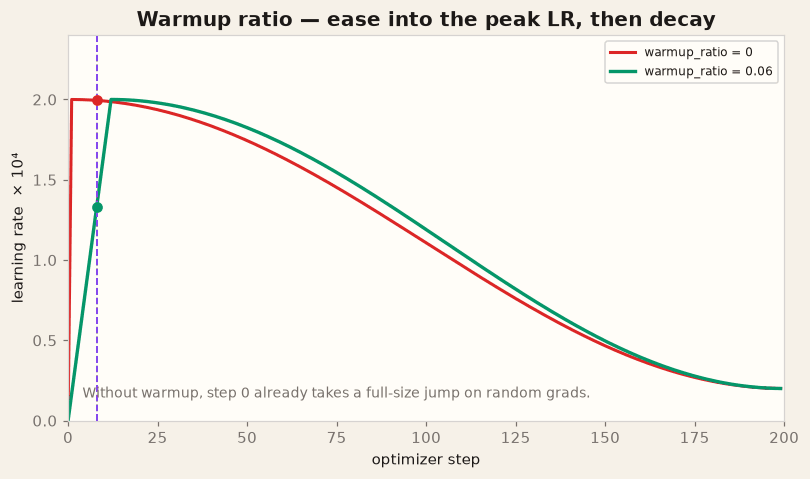

**Typical ranges.**

| Knob | Typical | This guide |
| --- | --- | --- |
| `warmup_ratio` | `0.03` – `0.10` | **`0.03`** |
| `warmup_steps` | 50–200 on short jobs | Use ratio so it scales with epoch/batch changes |
| No warmup | Short, already-stable runs | Fine *after* you have seen a clean first 50 steps |

**Common mistakes.**

- `warmup_ratio=0.5` on a 200-step toy run: you spend half the job not at the LR you thought you set.
- Changing `num_train_epochs` and leaving a huge absolute `warmup_steps` that now outlives the run.
- Blaming the optimizer for a first-step spike that warmup would have eaten.

**Interactions.** Warmup × learning rate (high LR needs warmup more). Warmup × batch size (bigger batches → fewer steps → the same ratio is fewer warmup steps — usually OK). Warmup × cosine decay (the peak must actually be reached).

```python
args = TrainingArguments(
    learning_rate=2e-4,
    warmup_ratio=0.03,
    lr_scheduler_type="cosine",
)
```

### Key takeaways

- Warmup is a seatbelt, not a personality.
- Prefer a **ratio** so the ramp scales when you change epochs.
- If step 0–20 explode, add warmup before you throw away AdamW.

---

## Weight decay

**What it is.** A penalty on large weights, usually **decoupled** L2 in AdamW: after the adaptive update, pull parameters slightly toward zero (`w ← w − lr × decay × w`). It is not the same thing as the `weight_decay` you might remember from raw Adam + L2-in-the-loss.

**What it controls.** How free the adapter is to grow. A little decay is a regularizer. A lot of decay can keep LoRA from learning a sharp style. On tiny SFT sets it is a supporting actor; dropout and fewer epochs do more.

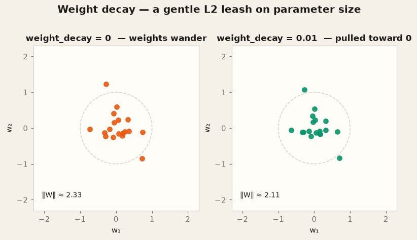

**Typical ranges.**

| Setup | Weight decay |
| --- | --- |
| LoRA SFT (this guide) | **`0.01`** |
| Already heavy dropout / tiny `r` | `0.0` |
| Full fine-tune | `0.01` – `0.1` (follow the base model’s paper) |
| “I copied `0.1` from an ImageNet recipe” | Too much for LoRA SFT |

**Common mistakes.**

- Thinking weight decay *is* dropout. They both regularize; they hit different objects.
- Applying decay to bias / LayerNorm when your stack lets you exclude them (AdamW implementations differ — `adamw_torch` is the safe default).
- Cranking decay to 0.1 to “fix overfitting” instead of getting more data.

**Interactions.** Weight decay × epochs (more passes, more need for a leash). Weight decay × LoRA rank (high capacity overfits sooner). Weight decay × learning rate (both shrink / move weights; a huge decay with a huge LR is two feet on two pedals).

```python
args = TrainingArguments(
    weight_decay=0.01,
    optim="adamw_torch",
)
```

### Key takeaways

- `0.01` is a reasonable LoRA default; `0.0` is also fine on short jobs.
- Decay will not rescue a 40-row dataset from memorization.
- Use AdamW’s decoupled decay, not a random other optimizer “because Twitter.”

---

## Optimizer

**What it is.** The rule that turns gradients into weight updates. **AdamW** keeps a per-parameter velocity and a per-parameter scale (first and second moments) and applies **decoupled** weight decay. SGD is a plain step. 8-bit / paged AdamW are memory-saving implementations of the same idea.

**What it controls.** The *shape* of the walk downhill, not the destination. On the skinny valleys of neural-net loss, SGD zigzags; AdamW stretches the axes so each coordinate can take a sensible step.

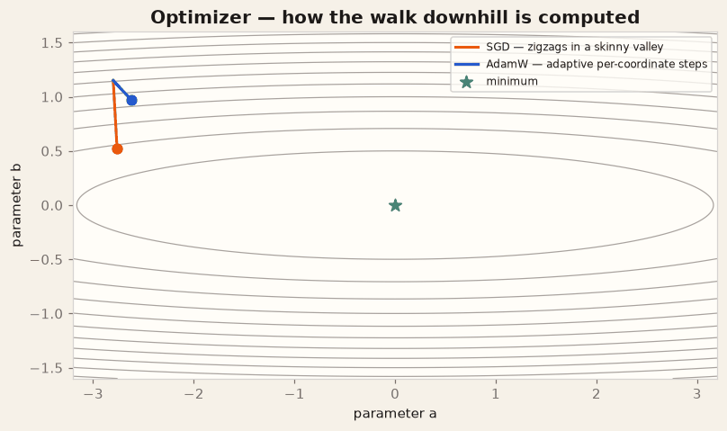

**Typical ranges / choices.**

| Name | When to use |
| --- | --- |
| **`adamw_torch`** | **Default.** Correct, widely tested, matches most SFT writeups |
| `adamw_8bit` / `paged_adamw_8bit` | QLoRA on a tight card; same algorithm, smaller optimizer state |
| `adamw_bnb_8bit` | Same family, bitsandbytes |
| SGD + momentum | Teaching demos, not 7B LoRA |
| Lion / Adafactor / “the new one” | After the rest of the recipe is boringly reliable |

**Common mistakes.**

- Switching optimizer to chase 0.01 eval-loss points on a 200-row set.
- Mixing an 8-bit optimizer with a dtype / device-map combo you have not run once.
- Forgetting that fused / 8-bit variants still want the **same** LR ballpark as AdamW, not SGD’s LR.

**Interactions.** Optimizer × learning rate (AdamW’s default LR band is this guide’s). Optimizer × weight decay (AdamW is what makes `weight_decay=0.01` mean what you think). Optimizer × batch size (adaptive methods tolerate noisier grads than vanilla SGD).

```python
args = TrainingArguments(
    optim="adamw_torch",
    learning_rate=2e-4,
    weight_decay=0.01,
    max_grad_norm=1.0,   # clip; a friend of any optimizer when one batch is cursed
)
```

### Key takeaways

- AdamW is the default for a reason.
- 8-bit AdamW is an implementation, not a new algorithm.
- Clip gradients (`max_grad_norm=1.0`) before you invent a new optimizer.

---

## LoRA rank (`r`)

**What it is.** The inner dimension of the adapter. For a frozen weight `W ∈ R^{d×k}` you train `B ∈ R^{d×r}` and `A ∈ R^{r×k}`. The update `ΔW = scale · B A` can only be rank-`r`. Bigger `r` means a richer update and more trainable parameters (`≈ 2 · r · d` per targeted matrix).

**What it controls.** **Capacity.** Rank 4 can teach a short style tag. Rank 16 is enough for most instruct-SFT format + tone jobs. Rank 64 can absorb more of a domain — and memorize a small set that much faster.

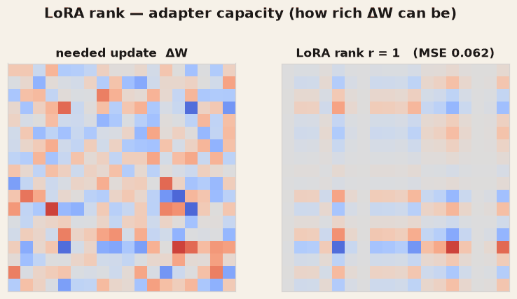

**Typical ranges.**

| Rank | Parameters (ballpark, 7B, attn+MLP) | When |
| --- | --- | --- |
| 4–8 | Smallest useful adapter | Style-only, or a smoke test |
| **16** | The default | **Start here** |
| 32–64 | 2–4× the adapter | Domain language, bigger data |
| 128+ | Rarely worth it on 7B SFT | You are close to “just full-tune a layer” |

**Common mistakes.**

- `r=64` on a teaching JSONL, then calling the model “overfit” as if that were mysterious.
- Raising rank to fix a **wrong chat template**. Rank cannot unbreak tokenization.
- Comparing two ranks with different alphas so the **scale** (`α/r`) also changed.

**Interactions.** Rank × alpha (scale = α/r — keep the ratio still if you only wanted capacity). Rank × dropout / epochs (regularize more as capacity grows). Rank × target modules (rank 16 on seven projections is already a lot more capacity than rank 16 on `q_proj` only). Rank × learning rate (higher capacity can tolerate a slightly lower LR).

```python
from peft import LoraConfig, TaskType

lora = LoraConfig(
    r=16,
    lora_alpha=32,          # scale = 32/16 = 2
    lora_dropout=0.05,
    bias="none",
    task_type=TaskType.CAUSAL_LM,
    target_modules=["q_proj", "k_proj", "v_proj", "o_proj",
                    "gate_proj", "up_proj", "down_proj"],
)
```

### Key takeaways

- Rank is how *expressive* the adapter may be, not how “smart” the base model is.
- Start at **16**. Go to 32 only after data and template are not the bottleneck.
- If `print_trainable_parameters()` is ~0%, you have a target-module problem, not a rank problem.

---

## LoRA alpha

**What it is.** The numerator of the adapter scale. PEFT applies `ΔW = (alpha / r) · B A` (some stacks also fold this into init; read your `LoraConfig` docs if you fork versions). Alpha is a **volume** knob. Rank is a **capacity** knob.

**What it controls.** How loud the adapter is relative to the frozen `W`. If you fix `r` and double alpha, every adapter step kicks twice as hard — similar in spirit to doubling the learning rate, but local to LoRA.

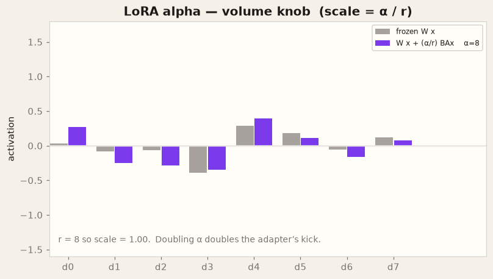

**Typical ranges.**

| Convention | Alpha | Scale if `r=16` |
| --- | --- | --- |
| **`alpha = 2r` (this guide)** | **32** | 2 |
| `alpha = r` | 16 | 1 |
| “I saw 64 on a 7B blog” | 64 | 4 — noisy unless you cut LR |

**Common mistakes.**

- Changing alpha and rank together without writing down the scale.
- Copying `lora_alpha=16` from a `r=64` recipe (scale 0.25 — the adapter whispers).
- Using alpha as a substitute for “I should have trained another epoch.”

**Interactions.** Alpha × rank (the ratio *is* the scale). Alpha × learning rate (two volume knobs). Alpha × dropout (a loud adapter with no dropout memorizes faster).

```python
lora = LoraConfig(
    r=16,
    lora_alpha=32,   # keep alpha / r = 2 when you change r, unless you mean to
)
```

### Key takeaways

- Think **`alpha / r`**, not alpha alone.
- Default scale **2** (`r=16`, `alpha=32`).
- If you raise alpha, consider lowering LR — you already turned the volume up.

---

## LoRA dropout

**What it is.** Dropout applied to the **adapter activations** during training (not to the frozen base). Each step, a fraction `p` of those units are zeroed. At inference, dropout is off and the full adapter runs.

**What it controls.** A small regularizer against memorizing the SFT set. On thousands of diverse chats, `0.0`–`0.05` is plenty. On 150 similar notes, `0.05`–`0.10` earns its keep.

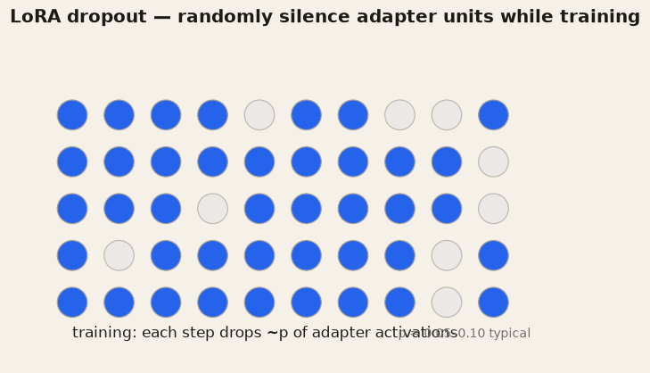

**Typical ranges.**

| Data | `lora_dropout` |
| --- | --- |
| Large, varied SFT | `0.0` – `0.05` |
| **Small / this guide** | **`0.05`** |
| Overfitting hard | `0.10` (then get more data) |
| `0.3` “because vision models” | Too high; the adapter learns noise |

**Common mistakes.**

- Leaving dropout **on** in a hand-rolled generate path (PEFT normally handles this with `model.eval()`).
- Using dropout 0.3 and a tiny rank, then saying LoRA cannot fit the format.
- Expecting dropout to fix label noise. It will not.

**Interactions.** Dropout × epochs × rank (the overfitting trio). Dropout × weight decay (stacking regularizers — add one at a time). Dropout does nothing useful if you never call `train()`.

```python
lora = LoraConfig(r=16, lora_alpha=32, lora_dropout=0.05)
model.train()   # dropout active
model.eval()    # dropout off — this is what generate should see
```

### Key takeaways

- `0.05` is a good small-data default; `0.0` is fine at scale.
- Inference must run in eval mode or you sample through a random mask.
- Dropout is not a data-cleaning tool.

---

## Target modules

**What it is.** The list of **linear layer names** that receive an `A`/`B` pair. Names are **model-family-specific**. Qwen2.5 dense blocks use `q_proj`, `k_proj`, `v_proj`, `o_proj` (attention) and `gate_proj`, `up_proj`, `down_proj` (MLP). Llama looks similar. Gemma / others may differ. `print(model)` is the source of truth.

**What it controls.** *Where* capacity is spent. Attention-only adapters are cheaper and often enough for mild style. Attention + MLP is the default for instruction SFT that must change *what* gets written, not just *how it is attended*. Target the wrong strings and you train **nothing**.

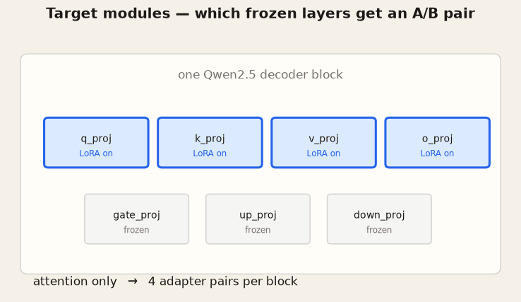

**Typical ranges / choices.**

| Target list | VRAM / params | When |
| --- | --- | --- |
| `q_proj`, `v_proj` only | Lowest | Old blogs; usually **underfits** instruct SFT |
| Attention (`q,k,v,o`) | Low | Style, light format |
| **Attention + MLP (this guide)** | Default | **7B instruct SFT** |
| Every linear including embeddings | Highest | Rarely what you meant |

**Common mistakes.**

- Copying `query_key_value` from a GPT-NeoX blog onto Qwen (0% trainable).
- Using `target_modules="all-linear"` without reading which linears you just unfroze.
- Mixing module names from Qwen2 and a MoE cousin.

**Interactions.** Targets × rank (seven modules at `r=16` ≫ two modules at `r=16`). Targets × batch / seq length (more adapters → a little more memory). Targets × tokenizer (no interaction — if quality collapses, check the template first anyway).

```python
# After get_peft_model:
model.print_trainable_parameters()
# Expect something like: trainable% ~ 0.5–2% for r=16 on attn+MLP, 7B.
# trainable% == 0.00  →  your names did not match this checkpoint.
```

### Key takeaways

- Target names are **strings on this checkpoint**, not a universal constant.
- Default to attention + MLP on Qwen2.5 / Llama-style dense models.
- `print_trainable_parameters()` is the unit test for this knob.

---

## Max sequence length

**What it is.** The token budget for each **training** example (`max_seq_length` in TRL, `max_length` on the tokenizer). Tokens past the cut are dropped. This is not `max_new_tokens` (that is inference).

**What it controls.** What the loss is even allowed to see. If your prompt is 900 tokens and the gold answer is 300, a `max_seq_length=1024` run is mostly training on the prompt and a stub of the answer. Memory and speed scale roughly linearly with this number (worse with attention).

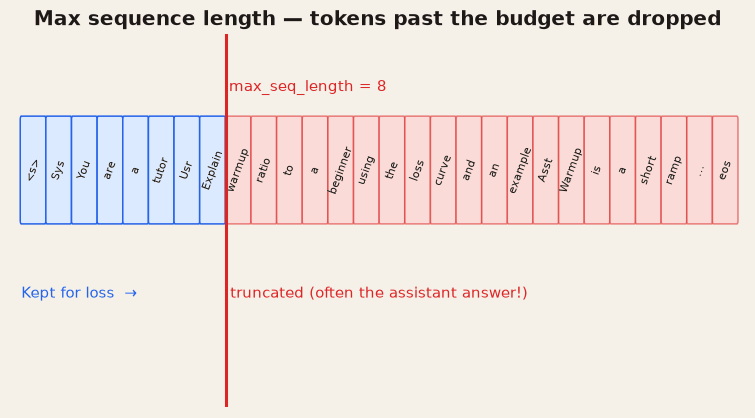

**Typical ranges.**

| Task | `max_seq_length` |
| --- | --- |
| Short chats / classification-shaped SFT | 512 |
| **Default instruct SFT (this guide)** | **1024** |
| Notes, tickets, multi-turn | 2048 |
| Long-context models “because we can” | Measure first; 8192 OOMs more recipes than it saves |

**Common mistakes.**

- Setting 4096 “for quality” on a dataset whose 95th percentile is 600 tokens.
- Packing examples poorly so truncation eats the **assistant** side (the part you wanted to learn).
- Confusing this with the model’s marketed context window. You can train at 1024 on a 32k model.

**Interactions.** Seq length × batch size (the OOM couple). Seq length × epochs (longer examples → fewer fit per batch → fewer steps unless you accumulate). Seq length × packing (`packing=True` in some SFT trainers stitches short rows — great for throughput, easy to misuse with chat templates).

```python
from trl import SFTConfig

sft = SFTConfig(
    max_seq_length=1024,
    packing=False,          # keep False until you know the template still lines up
    per_device_train_batch_size=1,
)
```

Sanity check before a long job:

```python
lengths = [len(tokenizer(text)["input_ids"]) for text in texts]
print(max(lengths), sorted(lengths)[int(0.95 * len(lengths))])
# if 95th percentile >> max_seq_length, you are quietly dropping answers
```

### Key takeaways

- This knob truncates **training text**, often the label.
- Fit the 95th percentile, not the marketing context length.
- OOM? Shorten sequences before you delete MLP targets in a panic.

---

# Inference-time hyperparameters

The weights are frozen now. These knobs only change **which next token** you draw, and **when you stop drawing**.

---

## Temperature

**What it is.** A divisor on the logits before softmax: `softmax(z / T)`. `T → 0` makes the distribution a spike on the winning token (greedy). `T > 1` flattens it so unlikely tokens get more mass.

**What it controls.** Randomness / “creativity” in the everyday sense. Low T: safer, more repetitive, better at extraction. High T: more variety, more chance of a confident wrong turn.

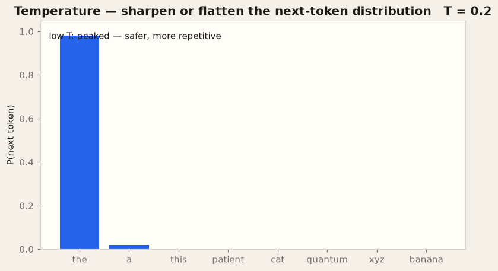

**Typical ranges.**

| Use | Temperature |
| --- | --- |
| JSON / classification / extraction | `0.0` – `0.2` |
| **General chat (this guide)** | **`0.7`** |
| Brainstorm, metaphor, variety | `0.9` – `1.1` |
| `1.5+` | Party trick; you will need strong top-p |

**Common mistakes.**

- `temperature=0` *and* top-p 0.9 *and* top-k 50: the extra filters do almost nothing because one token already owns the mass.
- Raising T to hide a badly fine-tuned adapter (“it sounds less canned if it’s confused”).
- Comparing two adapters at different temperatures and calling one “smarter.”

**Interactions.** Temperature × top-p / top-k (filters apply *after* the softmax you just reshaped). Temperature × max tokens (a wild sampler with a long budget writes novels). Temperature does not interact with LoRA rank except in the social sense that people retune both when lost.

```python
out = model.generate(
    **inputs,
    max_new_tokens=512,
    do_sample=True,
    temperature=0.7,
    top_p=0.9,
)
```

### Key takeaways

- Temperature reshapes the whole distribution; it does not “turn on creativity” inside the weights.
- Chat: **0.7**. Tools / JSON: near **0**.
- Change T *or* top-p first, not both, when you A/B a voice.

---

## Top-p (nucleus)

**What it is.** After softmax, sort tokens by probability and keep the **smallest prefix whose cumulative mass is at least `p`**. Everyone else is zeroed and the nucleus is renormalized. Also called nucleus sampling.

**What it controls.** A **probability budget** for how far into the tail you may go. `p=0.9` means “ignore the long tail that sums to 10%.” Unlike top-k, the number of surviving tokens **changes with the distribution**: peaked steps keep 1–2 tokens; flat steps keep many.

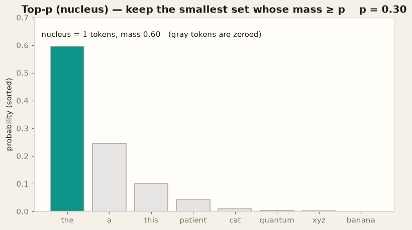

**Typical ranges.**

| `top_p` | Effect |
| --- | --- |
| `0.8` | Tighter, more conservative |
| **`0.9`** | **Default chat** |
| `0.95` | A little more tail |
| `1.0` | Off (all tokens remain, then temperature does the work) |

**Common mistakes.**

- `top_p=0.3` with `temperature=1.2`: you flattened, then threw almost everything away.
- Tuning top-p and top-k together until you cannot explain the sampler.
- Assuming `p` is “percentage of vocabulary.” It is percentage of **probability mass**.

**Interactions.** Top-p × temperature (T changes the mass landscape that p then clips). Top-p × top-k (the usual rule: **pick one** as the real filter). Top-p × stop sequences (no math interaction; a sloppy sampler hits a stop later or never).

```python
out = model.generate(**inputs, do_sample=True, temperature=0.7, top_p=0.9)
```

### Key takeaways

- Nucleus = “keep enough tokens to cover probability `p`.”
- Default **0.9**. Set **1.0** if you want temperature-only sampling.
- Do not use a tiny p to compensate for a huge T.

---

## Top-k

**What it is.** Keep only the `k` highest-probability tokens, zero the rest, renormalize. A **count**, not a mass.

**What it controls.** A hard cap on vocabulary at each step. `k=1` is greedy among the top score (almost argmax). `k=50` is a wide but finite menu. On a peaked distribution, k=50 and k=8 behave the same because only a few tokens had mass anyway.

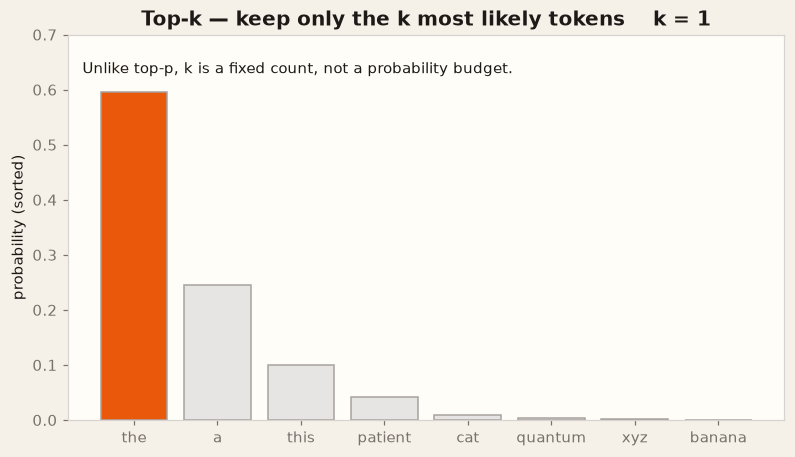

**Typical ranges.**

| `top_k` | Effect |
| --- | --- |
| `0` / omitted | Disabled in many Hugging Face paths |
| `20` | Conservative |
| **`50`** | **Common default when enabled** |
| `100+` | Close to off on most steps |

**Common mistakes.**

- `top_k=5` on chat: you clipped the model into a small thesaurus; it sounds samey for a different reason than low temperature.
- Enabling k=50 *and* p=0.7 *and* T=0.9 as three personality sliders.
- Believing k=50 means “the model knows 50 words.” It is 50 **candidates this step**.

**Interactions.** Top-k × top-p (intersection of the two filters — document which one your server applies first). Top-k × temperature (flat T + tiny k is a weird vise). If you already like top-p, you can leave k disabled.

```python
out = model.generate(
    **inputs,
    do_sample=True,
    temperature=0.7,
    top_p=0.9,
    top_k=50,          # or omit
)
```

### Key takeaways

- Top-k is a fixed head-count; top-p is a mass budget. They are not synonyms.
- **50** is a reasonable cap; disable it if top-p is doing the job.
- A tiny k makes the model sound repetitive even at high T.

---

## Max tokens / `max_new_tokens`

**What it is.** The hard cap on **newly generated** tokens. Hugging Face prefers `max_new_tokens`. Older `max_length` is prompt length + new tokens, which is easy to mis-set. This is not `max_seq_length` (training).

**What it controls.** How long the model is allowed to talk, and whether it is cut off mid-thought. It also bounds latency and cost. The model does not “know” the cap in the sense of outlining a shorter essay; it just hits a wall.

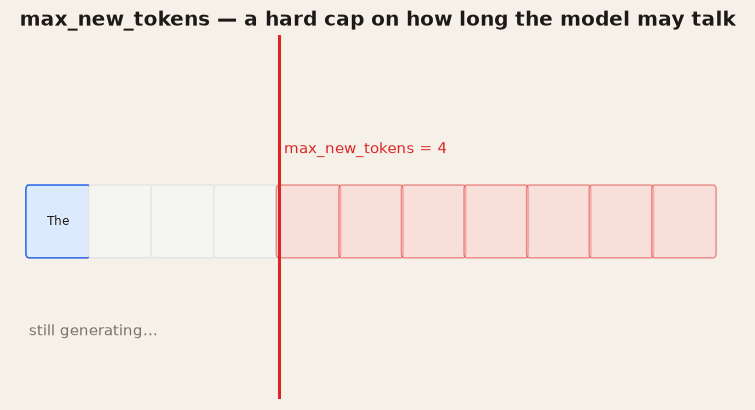

**Typical ranges.**

| Task | `max_new_tokens` |
| --- | --- |
| Classification, short JSON | 32–128 |
| **Chat reply (this guide)** | **512** |
| Notes, long explanations | 1024–2048 |
| “Unlimited” | You will pay for loops |

**Common mistakes.**

- Setting `max_length=512` when the prompt is already 480 tokens → 32 new tokens of “answer.”
- Raising the cap to 4096 because one user wanted a novel, then wondering why a runaway repetition is expensive.
- Treating cutoff as a training bug. Check the generate call first.

**Interactions.** Max tokens × stop sequences (stops can end *before* the cap). Max tokens × temperature (long + hot = rambling). Max tokens × server timeout (the real cap may be time, not tokens).

```python
out = model.generate(
    **inputs,
    max_new_tokens=512,   # prefer this
    # max_length=...      # avoid unless you mean prompt + new
    eos_token_id=tokenizer.eos_token_id,
)
```

### Key takeaways

- `max_new_tokens` is an output budget, not a training length.
- Size it to the task; do not use “big” as a quality setting.
- Cutoff mid-sentence is this knob (or a stop list you forgot) until proven otherwise.

---

## Stop sequences

**What it is.** Strings or token IDs that mean “end the generation **now**, even if `max_new_tokens` remains.” Always include the model’s EOS / `<|im_end|>`. Add harness markers if the model was trained to emit them (`\nUser:`, `###`, `<|eot_id|>`).

**What it controls.** Whether the assistant keeps speaking in the user’s voice, reprints the prompt, or opens a second turn. Stops are **product** rules. They do not change the distribution; they cancel the rest of the budget when a marker appears.

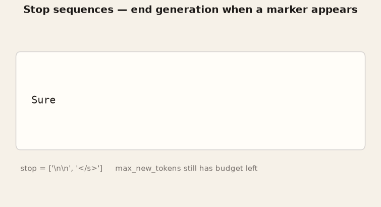

**Typical ranges / choices.**

| Stop | Why |
| --- | --- |
| EOS / `<|im_end|>` / `<|eot_id|>` | **Always** — family-specific |
| `\n\nHuman:` / `\nUser:` | Old completion-style models |
| ` ``` ` or `\n}` | Code / JSON harnesses |
| A word that appears in good answers | You will clip real content |

**Common mistakes.**

- Stopping on `"\n"` for a model that writes lists.
- Forgetting EOS after a fine-tune that learned to ramble past the template.
- Putting the stop string in the **prompt** so the first generate is empty.
- Different stops in eval vs production, then “the eval looked fine.”

**Interactions.** Stops × max tokens (whichever fires first). Stops × chat template (the end marker is part of the template; train and serve the same one). Stops × temperature (a drunk sampler is more likely to emit a weird path that *never* hits your marker — then the cap saves you).

```python
stop_ids = [tokenizer.eos_token_id]
# Qwen-style extra, if present:
im_end = tokenizer.convert_tokens_to_ids("<|im_end|>")
if im_end is not None and im_end != tokenizer.unk_token_id:
    stop_ids.append(im_end)

out = model.generate(
    **inputs,
    max_new_tokens=512,
    eos_token_id=stop_ids,
    temperature=0.7,
    top_p=0.9,
    do_sample=True,
)
```

Some servers also take raw strings:

```python
# vLLM / many HTTP stacks
sampling_params = dict(temperature=0.7, top_p=0.9, max_tokens=512, stop=["<|im_end|>", "\nUser:"])
```

### Key takeaways

- Stops are how you **end a turn**, not how you make the model smarter.
- Always stop on the real EOS for that template.
- Never stop on a substring that good answers need.

---

## How the knobs interact

A few pairs that show up in real debugging. If you change both sides of a pair in one run, you are guessing.

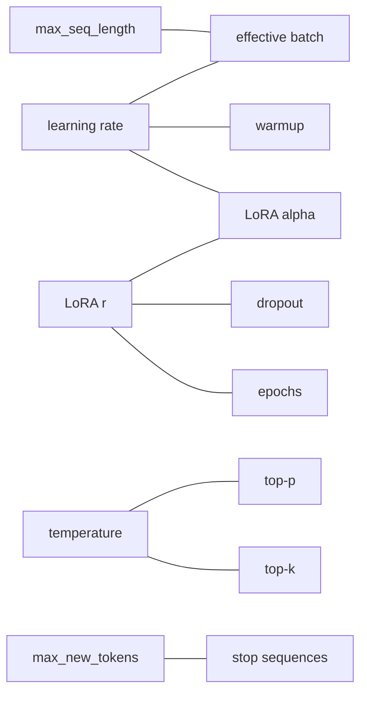

| Pair | What happens |
| --- | --- |
| LR × effective batch | Bigger batches → stabler grads → you can often raise LR a little; do it on purpose |
| LR × alpha | Both scale the LoRA update. Pick one volume knob |
| Rank × epochs × dropout | Capacity × repetitions × regularizer. The overfitting triangle |
| Seq length × micro-batch | Memory. Shorten text before you give up on MLP targets |
| Temperature × top-p | T reshapes, p clips. A/B one of them |
| Max new tokens × stops | First one to fire wins. Eval with both set as in production |

### Key takeaways

- One change per experiment is not purity; it is how you learn.
- Training pairs and inference pairs do not cancel across the freeze line.
- Write the pair down in the run name (`lr2e-4_r16_a32`) so future-you can read it.

---

## Troubleshooting

Match the symptom to the knob before you rewrite the dataset *and* the sampler.

| Symptom | First knob to suspect | Why | What to try |
| --- | --- | --- | --- |
| **Loss becomes NaN / Inf** | Learning rate (then mixed precision) | Step is too big; or a bad batch + no clip | Halve LR, `max_grad_norm=1.0`, confirm bf16/fp16 |
| **Loss spikes at step 0–20 then dies** | Warmup ratio | Full LR on random adapter grads | `warmup_ratio=0.03` or more |
| **Loss flat, model unchanged** | LR too low, or target modules | You are not updating what you think | `print_trainable_parameters()`, raise LR toward `2e-4` |
| **CUDA OOM** | Max seq length, then micro-batch | Activations scale with T × B | 1024→512, batch 2→1, then accumulate more |
| **Train loss great, eval / live bad** | Epochs, rank, dropout | Memorization | Fewer epochs, `r=16`, `lora_dropout=0.05`, more data |
| **0% trainable parameters** | Target modules | Names from another family | Print module names; use Qwen/Llama proj list |
| **Answers chopped in training previews** | Max sequence length | Label got truncated | Raise length or shorten prompts |
| **Live answers chopped mid-sentence** | `max_new_tokens` | Output budget | Raise cap or ask for shorter structure |
| **Repetitive “Sure, sure…” loops** | Temperature / top-p (and stops) | Sampler + no EOS | T=0.7, p=0.9, set EOS; add a repetition penalty only after that |
| **Gibberish / off-language** | Temperature too high, or wrong template | Tail sampling or train/serve mismatch | T≤0.8; confirm chat template |
| **Dull, templated, refuses variety** | Temperature too low | Near-greedy | 0.2 → 0.7 for chat |
| **JSON / fields missing** | Stops too eager, or max tokens too small | Cut on `\n` or 64-token cap | Fix stops; 128–256 tokens |
| **Model talks past the user turn** | Stop sequences | Missing `<\|im_end\|>` | Add the real template end token |
| **Quality collapse after “I loaded the adapter”** | Not a hyperparameter | Wrong base checkpoint under LoRA | Same `model_id` as training |
| **First GPU step is 10× slower than the rest** | Usually compile / warmup, not LR | Not a recipe bug | Ignore unless loss is also wild |

### Key takeaways

- NaN and OOM are almost always **LR** and **length/batch**.
- Repetition and cutoff are almost always **sampler + stops**.
- “It forgot the task” after a reload is usually **the wrong base model**, not rank.

---

## Where each knob appears in code

One place to stare. Training first, then LoRA, then generate.

```python
from peft import LoraConfig, TaskType, get_peft_model
from transformers import AutoModelForCausalLM, AutoTokenizer, TrainingArguments
from trl import SFTTrainer

model_id = "Qwen/Qwen2.5-7B-Instruct"
tokenizer = AutoTokenizer.from_pretrained(model_id)
model = AutoModelForCausalLM.from_pretrained(model_id, torch_dtype="bfloat16", device_map="auto")

lora = LoraConfig(
    r=16,                    # LoRA rank
    lora_alpha=32,           # LoRA alpha  (scale = 32/16)
    lora_dropout=0.05,       # LoRA dropout
    target_modules=[         # target modules
        "q_proj", "k_proj", "v_proj", "o_proj",
        "gate_proj", "up_proj", "down_proj",
    ],
    bias="none",
    task_type=TaskType.CAUSAL_LM,
)
model = get_peft_model(model, lora)
model.print_trainable_parameters()

args = TrainingArguments(
    output_dir="out/adapter",
    learning_rate=2e-4,                 # learning rate
    per_device_train_batch_size=1,      # batch size
    gradient_accumulation_steps=8,      # accumulation
    num_train_epochs=2,                 # epochs
    warmup_ratio=0.03,                  # warmup
    weight_decay=0.01,                  # weight decay
    optim="adamw_torch",                # optimizer
    lr_scheduler_type="cosine",
    bf16=True,
    logging_steps=10,
    max_grad_norm=1.0,
)

# TRL: max sequence length lives on SFTConfig / SFTTrainer, name varies by version.
trainer = SFTTrainer(
    model=model,
    args=args,
    train_dataset=train_ds,
    processing_class=tokenizer,
    # max_seq_length=1024,
)
# trainer.train()
```

Inference — weights frozen:

```python
prompt = tokenizer.apply_chat_template(
    [{"role": "user", "content": "Explain warmup ratio in one paragraph."}],
    tokenize=False,
    add_generation_prompt=True,
)
inputs = tokenizer(prompt, return_tensors="pt").to(model.device)

out = model.generate(
    **inputs,
    do_sample=True,
    temperature=0.7,          # temperature
    top_p=0.9,                # top-p
    top_k=50,                 # top-k
    max_new_tokens=512,       # max tokens
    eos_token_id=tokenizer.eos_token_id,  # stop sequences (IDs)
)
print(tokenizer.decode(out[0, inputs["input_ids"].shape[1]:], skip_special_tokens=True))
```

TRL / transformers versions rename `SFTTrainer` arguments every so often (`tokenizer` vs `processing_class`, `max_seq_length` vs `SFTConfig`). The **knobs** stay; if a name 404s, check the version you pinned.

---

## Regenerating the GIFs

The pictures are drawn with matplotlib, not recorded from a GPU run. After a clone:

```bash
python -m venv .venv
source .venv/bin/activate          # Windows: .venv\Scripts\activate
pip install -U pip
pip install -r requirements.txt
python scripts/generate_hyperparameter_gifs.py
python scripts/generate_hyperparameter_gifs.py --only temperature top_p
python scripts/generate_hyperparameter_gifs.py --list
```

Outputs land in [`docs/hyperparameters/gifs/`](gifs/). No Hugging Face token and no 7B download are required.

### Key takeaways

- GIFs are teaching diagrams you can rebuild in one command.
- The recipe in [Sensible defaults](#sensible-defaults) is the thing to copy into a real trainer.
- When something breaks, use the [troubleshooting table](#troubleshooting) before adding knobs.

---

## License

MIT. See [LICENSE](../../LICENSE) at the repo root. The guide text, GIFs, and generator were originally published in `llm-hyperparameters-guide` under the same license.
